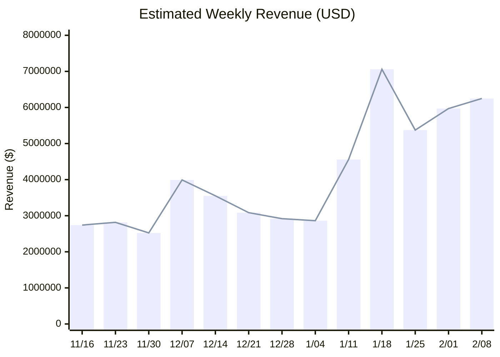
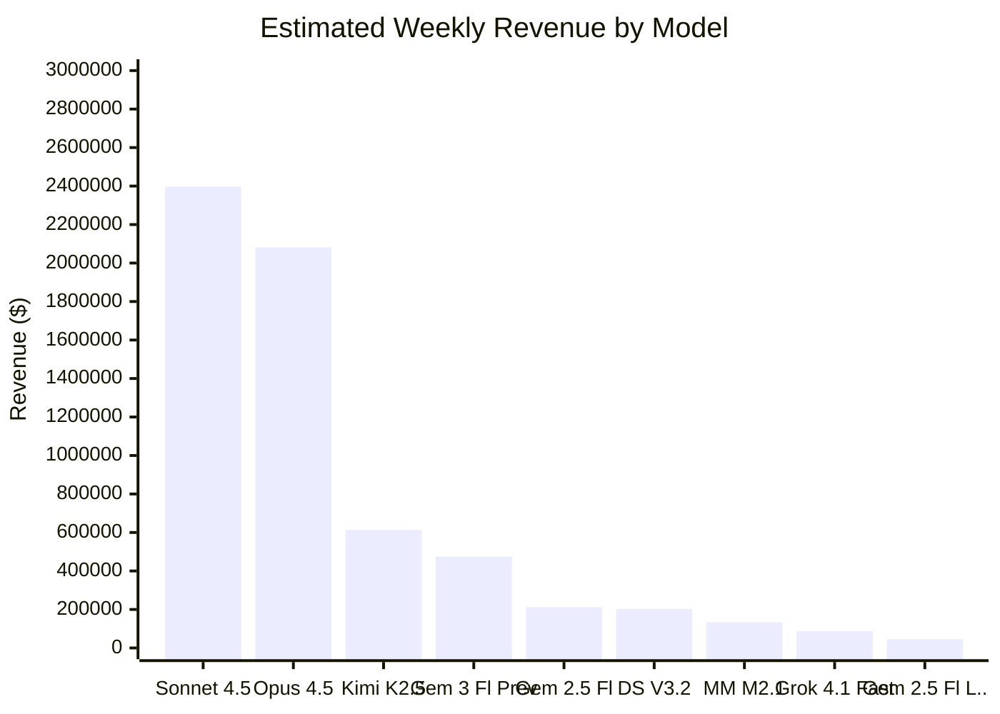
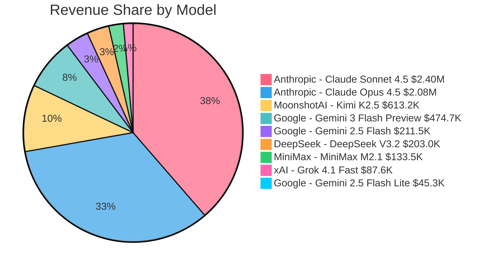
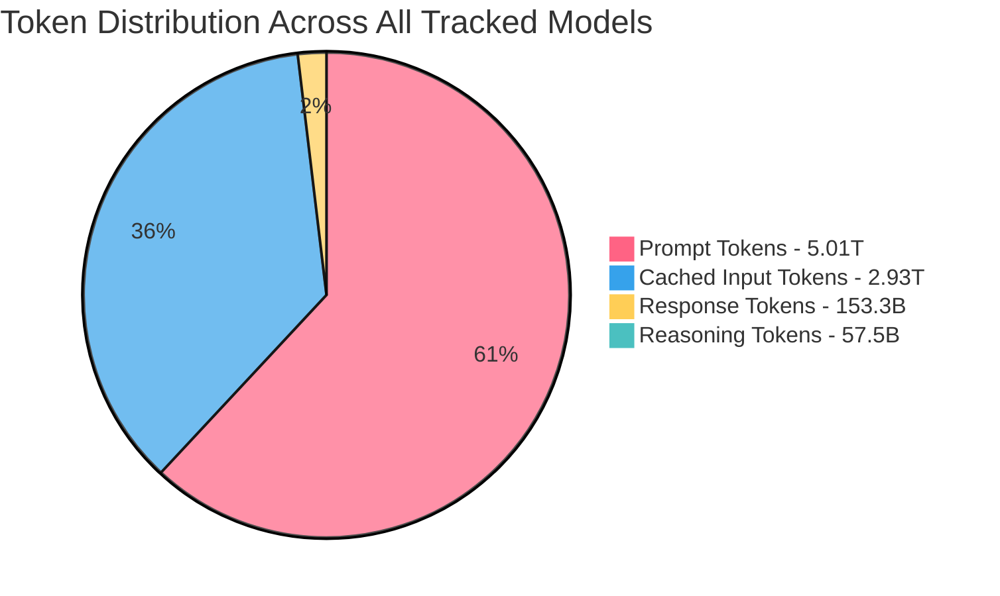

# OpenRouter Inference Revenue Statistics

> Estimated inference revenue across models on [OpenRouter](https://openrouter.ai/rankings), calculated from public usage data and pricing.

**Last updated:** 2026-02-08

## Summary

| Metric | Value |
|--------|-------|
| Estimated Weekly Revenue | **$6.25M** |
| Total Tokens Tracked | **5.22T** |
| Models Tracked | **9** (9 paid, 0 free) |

## Revenue Over Time

## Revenue by Model (Top 9)

## Revenue Share

## Token Type Distribution

## Model Breakdown

| Rank | Model | Total Tokens | Cached | Prompt % | Compl. % | Input Price | Output Price | Est. Revenue | WoW |
|------|-------|-------------|--------|----------|----------|-------------|-------------|-------------|-----|
| 3 | [Anthropic: Claude Sonnet 4.5](https://openrouter.ai/anthropic/claude-4.5-sonnet-20250929) | 705.6B | 448.4B | 98.3% | 1.7% | $3.00/M | $15.00/M | $2.40M | -9% |
| 7 | [Anthropic: Claude Opus 4.5](https://openrouter.ai/anthropic/claude-4.5-opus-20251124) | 369.9B | 248.9B | 98.5% | 1.5% | $5.00/M | $25.00/M | $2.08M | -2% |
| 1 | [MoonshotAI: Kimi K2.5](https://openrouter.ai/moonshotai/kimi-k2.5-0127) | 1.16T | 950.2B | 98.8% | 1.2% | $0.4500/M | $2.25/M | $613.2K | +222% |
| 2 | [Google: Gemini 3 Flash Preview](https://openrouter.ai/google/gemini-3-flash-preview-20251217) | 764.0B | 387.5B | 96.2% | 3.8% | $0.5000/M | $3.00/M | $474.7K | +11% |
| 6 | [Google: Gemini 2.5 Flash](https://openrouter.ai/google/gemini-2.5-flash) | 429.6B | 118.4B | 91.6% | 8.4% | $0.3000/M | $2.50/M | $211.5K | +6% |
| 4 | [DeepSeek: DeepSeek V3.2](https://openrouter.ai/deepseek/deepseek-v3.2-20251201) | 664.8B | 265.1B | 95.8% | 4.2% | $0.2500/M | $0.3800/M | $203.0K | +31% |
| 5 | [MiniMax: MiniMax M2.1](https://openrouter.ai/minimax/minimax-m2.1) | 441.9B | 349.1B | 98.7% | 1.3% | $0.2700/M | $0.9500/M | $133.5K | 0% |
| 8 | [xAI: Grok 4.1 Fast](https://openrouter.ai/x-ai/grok-4.1-fast) | 344.9B | 94.8B | 86.6% | 13.4% | $0.2000/M | $0.5000/M | $87.6K | +9% |
| 9 | [Google: Gemini 2.5 Flash Lite](https://openrouter.ai/google/gemini-2.5-flash-lite) | 343.7B | 66.0B | 90.0% | 10.0% | $0.1000/M | $0.4000/M | $45.3K | 0% |

## Methodology

This data is collected automatically from public sources:

1. **Model Pricing**: Fetched from the [OpenRouter API](https://openrouter.ai/api/v1/models) — per-token prices for prompt, completion, reasoning, and cache reads
2. **Usage Rankings**: Scraped from the [OpenRouter Rankings](https://openrouter.ai/rankings) page — top models by weekly token volume
3. **Token Breakdown**: Extracted from each model page's embedded daily analytics data — exact daily counts of prompt, completion, reasoning, and cached input tokens, summed over the most recent 7 full days

**Revenue Calculation**:
- `revenue = prompt_tokens × prompt_price + completion_tokens × output_price + cached_tokens × cache_read_price`
- Completion tokens include reasoning tokens (standard OpenAI convention); reasoning is **not** double-counted
- Cached input tokens are charged at the discounted `input_cache_read` rate

**Caveats**:
- Revenue estimates use list prices; actual revenue may differ due to volume discounts or BYOK usage
- Only the top models from the rankings page are tracked; the long tail of smaller models is not included
- Free models (price = $0) contribute $0 to revenue regardless of usage volume

---

*Data collected by [openrouter-inference-stats](https://github.com/johnbean393/openrouter-inference-stats) and updated weekly via GitHub Actions.*
