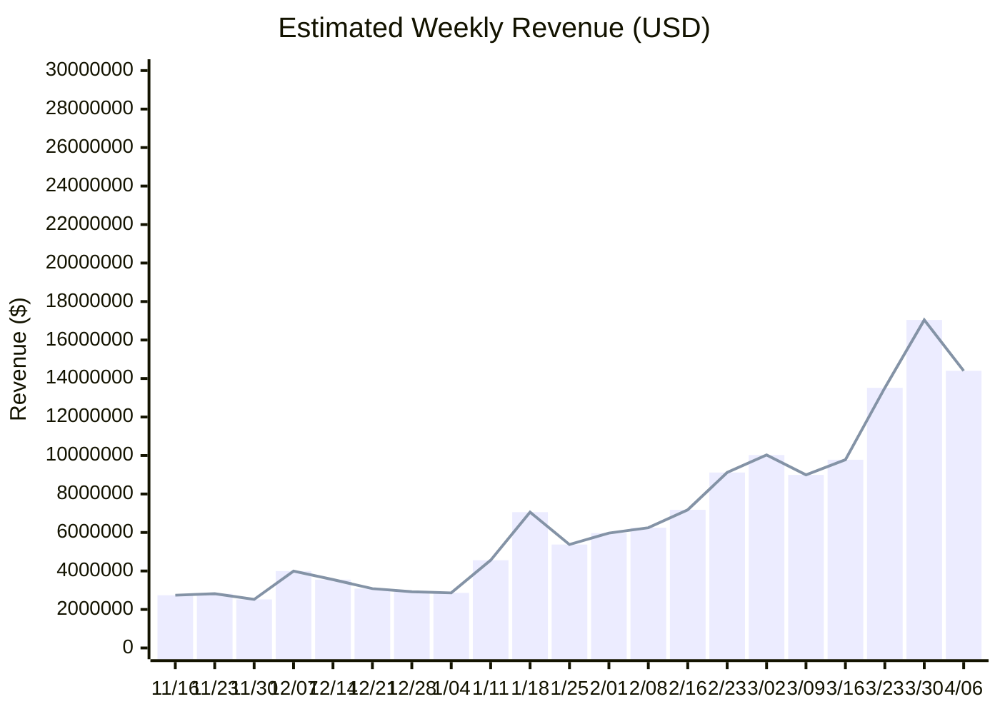
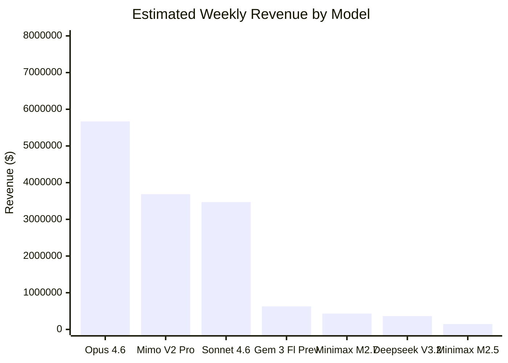
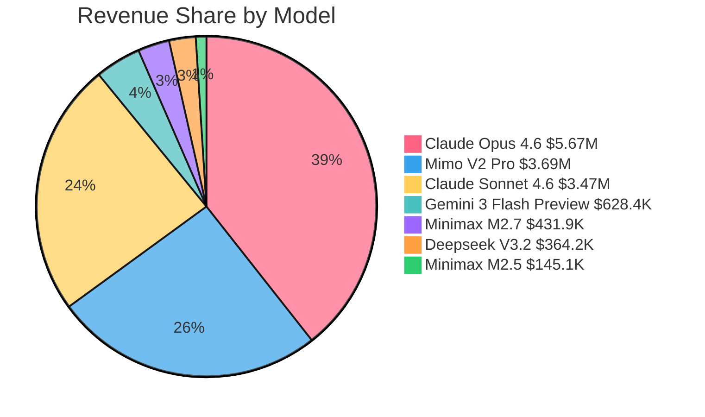
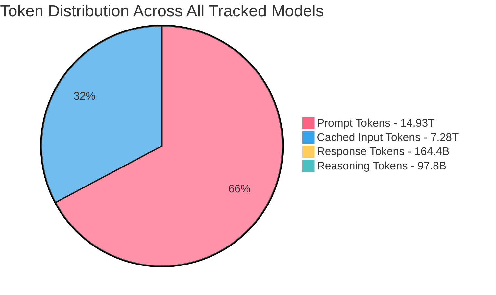

# OpenRouter Inference Revenue Statistics

> Estimated inference revenue across models on [OpenRouter](https://openrouter.ai/rankings), calculated from public usage data and pricing.

**Last updated:** 2026-04-06

## Summary

| Metric | Value |
|--------|-------|
| Estimated Weekly Revenue | **$14.40M** |
| Total Tokens Tracked | **16.84T** |
| Models Tracked | **10** (7 paid, 3 free) |

## Revenue Over Time

```mermaid
xychart-beta
    title "Estimated Weekly Revenue (USD)"
    x-axis ["11/16", "11/23", "11/30", "12/07", "12/14", "12/21", "12/28", "1/04", "1/11", "1/18", "1/25", "2/01", "2/08", "2/16", "2/23", "3/02", "3/09", "3/16", "3/23", "3/30", "4/06"]
    y-axis "Revenue ($)" 0 --> 30000000
    bar [2740620.94, 2816925.48, 2523142.13, 3991396.39, 3551394.6, 3084659.53, 2918272.88, 2862056.98, 4558077.75, 7057753.91, 5373700.56, 5970586.37, 6247827.58, 7177565.34, 9116055.43, 10024024.86, 8991833.66, 9781034.43, 13516359.09, 17042158.26, 14398956.04]
    line [2740620.94, 2816925.48, 2523142.13, 3991396.39, 3551394.6, 3084659.53, 2918272.88, 2862056.98, 4558077.75, 7057753.91, 5373700.56, 5970586.37, 6247827.58, 7177565.34, 9116055.43, 10024024.86, 8991833.66, 9781034.43, 13516359.09, 17042158.26, 14398956.04]
```

## Revenue by Model (Top 7)

```mermaid
xychart-beta
    title "Estimated Weekly Revenue by Model"
    x-axis ["Opus 4.6", "Mimo V2 Pro", "Sonnet 4.6", "Gem 3 Fl Prev", "Minimax M2.7", "Deepseek V3.2", "Minimax M2.5"]
    y-axis "Revenue ($)" 0 --> 8000000
    bar [5670081.26, 3686932.42, 3472325.95, 628362.43, 431940.33, 364204.3, 145109.36]
```

## Revenue Share

```mermaid
%%{init: {'theme': 'base', 'themeVariables': {'pie1': '#FF6384', 'pie2': '#36A2EB', 'pie3': '#FFCE56', 'pie4': '#4BC0C0', 'pie5': '#9966FF', 'pie6': '#FF9F40', 'pie7': '#2ECC71', 'pie8': '#FF66B2', 'pie9': '#00CCFF', 'pie10': '#E74C3C', 'pie11': '#F39C12', 'pie12': '#1ABC9C'}}}%%
pie
    title Revenue Share by Model
    "Claude Opus 4.6 $5.67M" : 5670081.26
    "Mimo V2 Pro $3.69M" : 3686932.42
    "Claude Sonnet 4.6 $3.47M" : 3472325.95
    "Gemini 3 Flash Preview $628.4K" : 628362.43
    "Minimax M2.7 $431.9K" : 431940.33
    "Deepseek V3.2 $364.2K" : 364204.3
    "Minimax M2.5 $145.1K" : 145109.36
```

## Token Type Distribution

```mermaid
%%{init: {'theme': 'base', 'themeVariables': {'pie1': '#FF6384', 'pie2': '#36A2EB', 'pie3': '#FFCE56', 'pie4': '#4BC0C0', 'pie5': '#9966FF', 'pie6': '#FF9F40', 'pie7': '#2ECC71', 'pie8': '#FF66B2', 'pie9': '#00CCFF', 'pie10': '#E74C3C', 'pie11': '#F39C12', 'pie12': '#1ABC9C'}}}%%
pie
    title Token Distribution Across All Tracked Models
    "Prompt Tokens - 14.93T" : 14934475135374
    "Cached Input Tokens - 7.28T" : 7284949890857
    "Response Tokens - 164.4B" : 164418254868
    "Reasoning Tokens - 97.8B" : 97836907582
```

## Model Breakdown

| Rank | Model | Total Tokens | Cached | Prompt % | Compl. % | Input Price | Output Price | Est. Revenue | WoW |
|------|-------|-------------|--------|----------|----------|-------------|-------------|-------------|-----|
| 8 | [Claude Opus 4.6](https://openrouter.ai/anthropic/claude-4.6-opus-20260205) | 1.02T | 707.0B | 98.9% | 1.1% | $5.00/M | $25.00/M | $5.67M | +2% |
| 2 | [Mimo V2 Pro](https://openrouter.ai/xiaomi/mimo-v2-pro-20260318) | 3.08T | 2.78T | 99.1% | 0.9% | $1.00/M | $3.00/M | $3.69M | -22% |
| 7 | [Claude Sonnet 4.6](https://openrouter.ai/anthropic/claude-4.6-sonnet-20260217) | 1.03T | 710.2B | 98.7% | 1.3% | $3.00/M | $15.00/M | $3.47M | 0% |
| 9 | [Gemini 3 Flash Preview](https://openrouter.ai/google/gemini-3-flash-preview-20251217) | 980.0B | 364.8B | 95.1% | 4.9% | $0.5000/M | $3.00/M | $628.4K | +1% |
| 5 | [Minimax M2.7](https://openrouter.ai/minimax/minimax-m2.7-20260318) | 1.19T | 975.1B | 98.6% | 1.4% | $0.3000/M | $1.20/M | $431.9K | -7% |
| 6 | [Deepseek V3.2](https://openrouter.ai/deepseek/deepseek-v3.2-20251201) | 1.19T | 390.0B | 96.9% | 3.1% | $0.2600/M | $0.3800/M | $364.2K | -4% |
| 10 | [Minimax M2.5](https://openrouter.ai/minimax/minimax-m2.5-20260211) | 848.0B | 657.8B | 99.2% | 0.9% | $0.1180/M | $0.9900/M | $145.1K | -7% |
| 1 | [Qwen3.6 Plus (free)](https://openrouter.ai/qwen/qwen3.6-plus-04-02:free) | 4.60T | 0 | 98.7% | 1.3% | Free | Free | $0.00 | 0% |
| 3 | [Qwen3.6 Plus Preview (free)](https://openrouter.ai/qwen/qwen3.6-plus-preview:free) | 1.64T | 0 | 0.0% | 0.0% | Free | Free | $0.00 | 0% |
| 4 | [Step 3.5 Flash (free)](https://openrouter.ai/stepfun/step-3.5-flash:free) | 1.26T | 701.5B | 96.9% | 3.1% | Free | Free | $0.00 | -16% |

## Methodology

This data is collected automatically from public sources:

1. **Model Pricing**: Fetched from the [OpenRouter API](https://openrouter.ai/api/v1/models) — per-token prices for prompt, completion, reasoning, and cache reads
2. **Usage Rankings**: Scraped from the [OpenRouter Rankings](https://openrouter.ai/rankings) page — top models by weekly token volume
3. **Token Breakdown**: Extracted from each model page's embedded daily analytics data — exact daily counts of prompt, completion, reasoning, and cached input tokens, summed over the most recent 7 full days

**Revenue Calculation**:
- `revenue = prompt_tokens × prompt_price + completion_tokens × output_price + cached_tokens × cache_read_price`
- Completion tokens include reasoning tokens (standard OpenAI convention); reasoning is **not** double-counted
- Cached input tokens are charged at the discounted `input_cache_read` rate

**Caveats**:
- Revenue estimates use list prices; actual revenue may differ due to volume discounts or BYOK usage
- Only the top models from the rankings page are tracked; the long tail of smaller models is not included
- Free models (price = $0) contribute $0 to revenue regardless of usage volume

---

*Data collected by [openrouter-inference-stats](https://github.com/johnbean393/openrouter-inference-stats) and updated weekly via GitHub Actions.*
