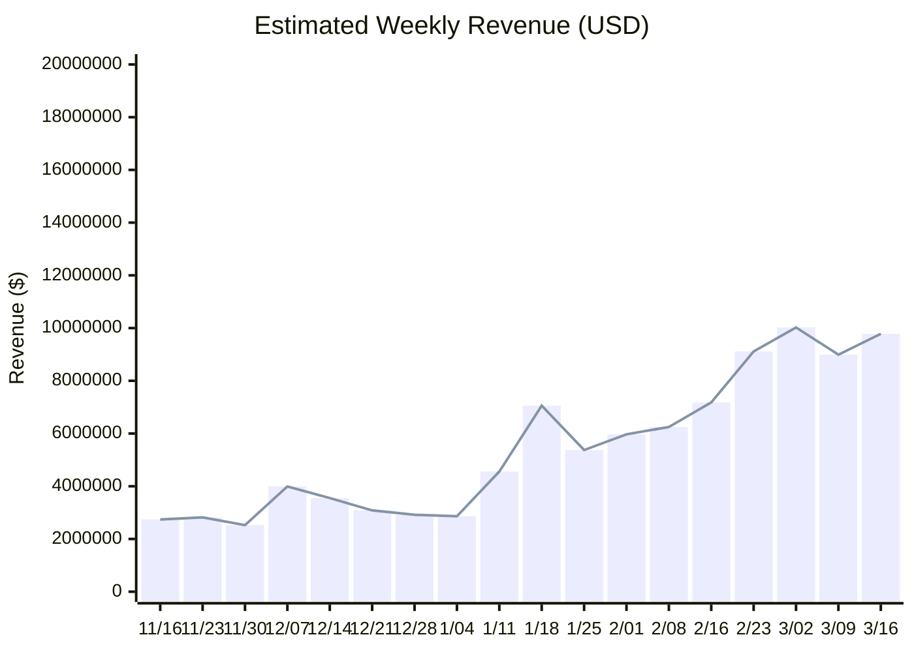
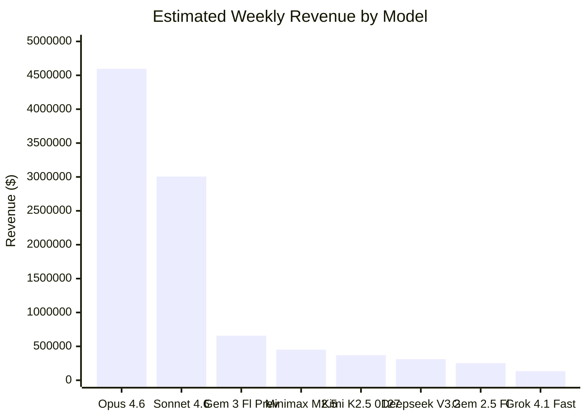
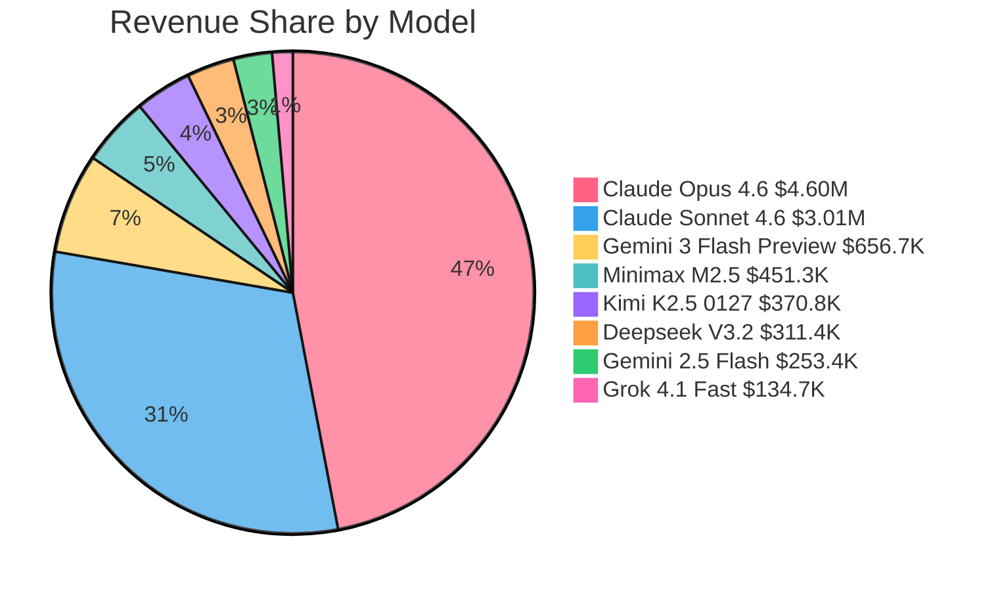

# OpenRouter Inference Revenue Statistics

> Estimated inference revenue across models on [OpenRouter](https://openrouter.ai/rankings), calculated from public usage data and pricing.

**Last updated:** 2026-03-16

## Summary

| Metric | Value |
|--------|-------|
| Estimated Weekly Revenue | **$9.78M** |
| Total Tokens Tracked | **9.19T** |
| Models Tracked | **10** (8 paid, 2 free) |

## Revenue Over Time

```mermaid
xychart-beta
    title "Estimated Weekly Revenue (USD)"
    x-axis ["11/16", "11/23", "11/30", "12/07", "12/14", "12/21", "12/28", "1/04", "1/11", "1/18", "1/25", "2/01", "2/08", "2/16", "2/23", "3/02", "3/09", "3/16"]
    y-axis "Revenue ($)" 0 --> 20000000
    bar [2740620.94, 2816925.48, 2523142.13, 3991396.39, 3551394.6, 3084659.53, 2918272.88, 2862056.98, 4558077.75, 7057753.91, 5373700.56, 5970586.37, 6247827.58, 7177565.34, 9116055.43, 10024024.86, 8991833.66, 9781034.43]
    line [2740620.94, 2816925.48, 2523142.13, 3991396.39, 3551394.6, 3084659.53, 2918272.88, 2862056.98, 4558077.75, 7057753.91, 5373700.56, 5970586.37, 6247827.58, 7177565.34, 9116055.43, 10024024.86, 8991833.66, 9781034.43]
```

## Revenue by Model (Top 8)

```mermaid
xychart-beta
    title "Estimated Weekly Revenue by Model"
    x-axis ["Opus 4.6", "Sonnet 4.6", "Gem 3 Fl Prev", "Minimax M2.5", "Kimi K2.5 0127", "Deepseek V3.2", "Gem 2.5 Fl", "Grok 4.1 Fast"]
    y-axis "Revenue ($)" 0 --> 5000000
    bar [4596367.57, 3006333.95, 656674.93, 451262.05, 370814.76, 311449.47, 253433.81, 134697.89]
```

## Revenue Share

```mermaid
%%{init: {'theme': 'base', 'themeVariables': {'pie1': '#FF6384', 'pie2': '#36A2EB', 'pie3': '#FFCE56', 'pie4': '#4BC0C0', 'pie5': '#9966FF', 'pie6': '#FF9F40', 'pie7': '#2ECC71', 'pie8': '#FF66B2', 'pie9': '#00CCFF', 'pie10': '#E74C3C', 'pie11': '#F39C12', 'pie12': '#1ABC9C'}}}%%
pie
    title Revenue Share by Model
    "Claude Opus 4.6 $4.60M" : 4596367.57
    "Claude Sonnet 4.6 $3.01M" : 3006333.95
    "Gemini 3 Flash Preview $656.7K" : 656674.93
    "Minimax M2.5 $451.3K" : 451262.05
    "Kimi K2.5 0127 $370.8K" : 370814.76
    "Deepseek V3.2 $311.4K" : 311449.47
    "Gemini 2.5 Flash $253.4K" : 253433.81
    "Grok 4.1 Fast $134.7K" : 134697.89
```

## Token Type Distribution

```mermaid
%%{init: {'theme': 'base', 'themeVariables': {'pie1': '#FF6384', 'pie2': '#36A2EB', 'pie3': '#FFCE56', 'pie4': '#4BC0C0', 'pie5': '#9966FF', 'pie6': '#FF9F40', 'pie7': '#2ECC71', 'pie8': '#FF66B2', 'pie9': '#00CCFF', 'pie10': '#E74C3C', 'pie11': '#F39C12', 'pie12': '#1ABC9C'}}}%%
pie
    title Token Distribution Across All Tracked Models
    "Prompt Tokens - 8.87T" : 8866825652827
    "Cached Input Tokens - 4.50T" : 4495058425771
    "Response Tokens - 196.0B" : 196007023737
    "Reasoning Tokens - 123.6B" : 123600166624
```

## Model Breakdown

| Rank | Model | Total Tokens | Cached | Prompt % | Compl. % | Input Price | Output Price | Est. Revenue | WoW |
|------|-------|-------------|--------|----------|----------|-------------|-------------|-------------|-----|
| 6 | [Claude Opus 4.6](https://openrouter.ai/anthropic/claude-4.6-opus-20260205) | 822.0B | 557.4B | 98.7% | 1.3% | $5.00/M | $25.00/M | $4.60M | +7% |
| 5 | [Claude Sonnet 4.6](https://openrouter.ai/anthropic/claude-4.6-sonnet-20260217) | 890.0B | 608.0B | 98.6% | 1.4% | $3.00/M | $15.00/M | $3.01M | +31% |
| 4 | [Gemini 3 Flash Preview](https://openrouter.ai/google/gemini-3-flash-preview-20251217) | 1.02T | 454.5B | 95.1% | 4.9% | $0.5000/M | $3.00/M | $656.7K | -3% |
| 1 | [Minimax M2.5](https://openrouter.ai/minimax/minimax-m2.5-20260211) | 1.75T | 1.39T | 99.2% | 0.9% | $0.2500/M | $1.20/M | $451.3K | -6% |
| 9 | [Kimi K2.5 0127](https://openrouter.ai/moonshotai/kimi-k2.5-0127) | 560.0B | 408.6B | 97.3% | 2.7% | $0.4500/M | $2.20/M | $370.8K | -25% |
| 3 | [Deepseek V3.2](https://openrouter.ai/deepseek/deepseek-v3.2-20251201) | 1.04T | 285.8B | 96.2% | 3.8% | $0.2600/M | $0.3800/M | $311.4K | +25% |
| 8 | [Gemini 2.5 Flash](https://openrouter.ai/google/gemini-2.5-flash) | 562.0B | 176.2B | 93.6% | 6.4% | $0.3000/M | $2.50/M | $253.4K | +9% |
| 10 | [Grok 4.1 Fast](https://openrouter.ai/x-ai/grok-4.1-fast) | 542.0B | 125.8B | 87.7% | 12.3% | $0.2000/M | $0.5000/M | $134.7K | -12% |
| 2 | [Step 3.5 Flash (free)](https://openrouter.ai/stepfun/step-3.5-flash:free) | 1.34T | 0 | 97.3% | 2.7% | Free | Free | $0.00 | +79% |
| 7 | [Hunter Alpha](https://openrouter.ai/openrouter/hunter-alpha) | 666.0B | 491.8B | 94.2% | 5.8% | Free | Free | $0.00 | 0% |

## Methodology

This data is collected automatically from public sources:

1. **Model Pricing**: Fetched from the [OpenRouter API](https://openrouter.ai/api/v1/models) — per-token prices for prompt, completion, reasoning, and cache reads
2. **Usage Rankings**: Scraped from the [OpenRouter Rankings](https://openrouter.ai/rankings) page — top models by weekly token volume
3. **Token Breakdown**: Extracted from each model page's embedded daily analytics data — exact daily counts of prompt, completion, reasoning, and cached input tokens, summed over the most recent 7 full days

**Revenue Calculation**:
- `revenue = prompt_tokens × prompt_price + completion_tokens × output_price + cached_tokens × cache_read_price`
- Completion tokens include reasoning tokens (standard OpenAI convention); reasoning is **not** double-counted
- Cached input tokens are charged at the discounted `input_cache_read` rate

**Caveats**:
- Revenue estimates use list prices; actual revenue may differ due to volume discounts or BYOK usage
- Only the top models from the rankings page are tracked; the long tail of smaller models is not included
- Free models (price = $0) contribute $0 to revenue regardless of usage volume

---

*Data collected by [openrouter-inference-stats](https://github.com/johnbean393/openrouter-inference-stats) and updated weekly via GitHub Actions.*
