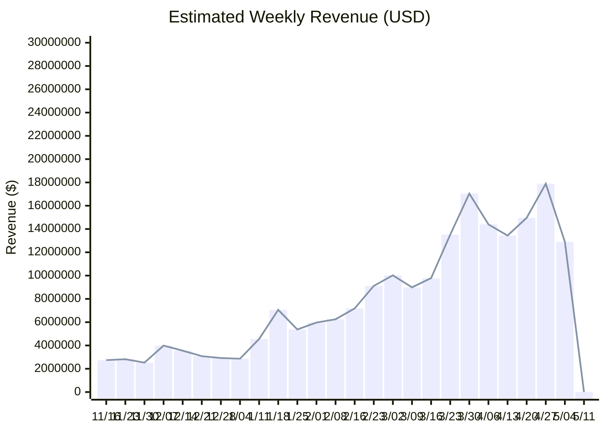
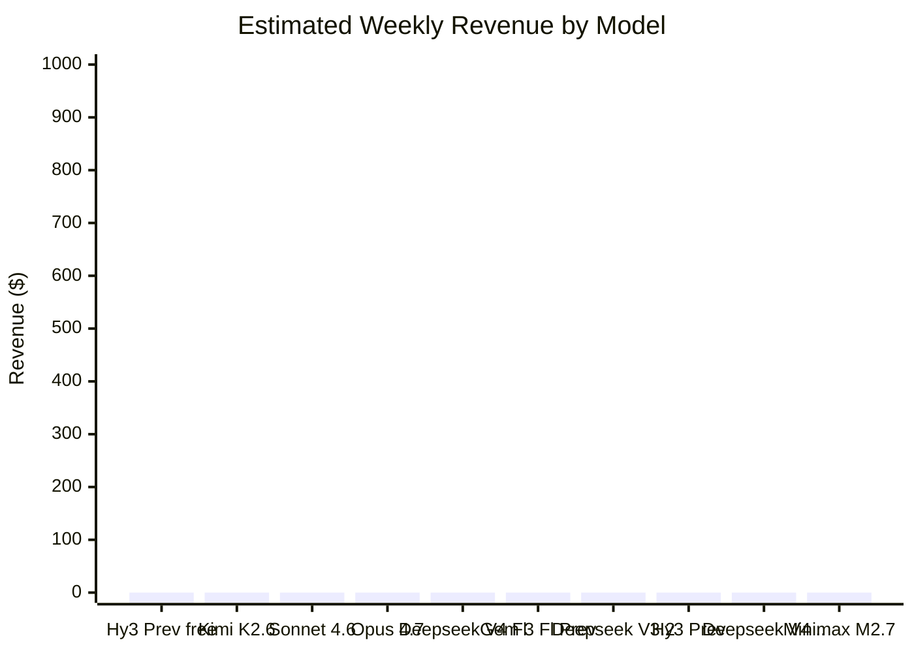
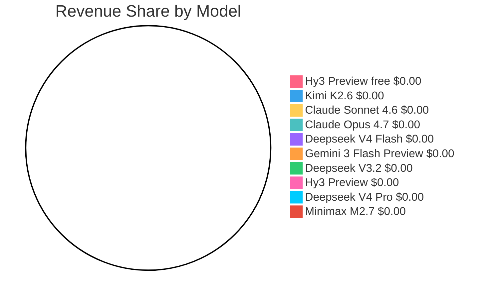

# OpenRouter Inference Revenue Statistics

> Estimated inference revenue across models on [OpenRouter](https://openrouter.ai/rankings), calculated from public usage data and pricing.

**Last updated:** 2026-05-11

## Summary

| Metric | Value |
|--------|-------|
| Estimated Weekly Revenue | **$0.00** |
| Total Tokens Tracked | **12.45T** |
| Models Tracked | **10** (10 paid, 0 free) |

## Revenue Over Time

```mermaid
xychart-beta
    title "Estimated Weekly Revenue (USD)"
    x-axis ["11/16", "11/23", "11/30", "12/07", "12/14", "12/21", "12/28", "1/04", "1/11", "1/18", "1/25", "2/01", "2/08", "2/16", "2/23", "3/02", "3/09", "3/16", "3/23", "3/30", "4/06", "4/13", "4/20", "4/27", "5/04", "5/11"]
    y-axis "Revenue ($)" 0 --> 30000000
    bar [2740620.94, 2816925.48, 2523142.13, 3991396.39, 3551394.6, 3084659.53, 2918272.88, 2862056.98, 4558077.75, 7057753.91, 5373700.56, 5970586.37, 6247827.58, 7177565.34, 9116055.43, 10024024.86, 8991833.66, 9781034.43, 13516359.09, 17042158.26, 14398956.04, 13440739.33, 14964047.88, 17890596.37, 12897765.5, 0.0]
    line [2740620.94, 2816925.48, 2523142.13, 3991396.39, 3551394.6, 3084659.53, 2918272.88, 2862056.98, 4558077.75, 7057753.91, 5373700.56, 5970586.37, 6247827.58, 7177565.34, 9116055.43, 10024024.86, 8991833.66, 9781034.43, 13516359.09, 17042158.26, 14398956.04, 13440739.33, 14964047.88, 17890596.37, 12897765.5, 0.0]
```

## Revenue by Model (Top 10)

```mermaid
xychart-beta
    title "Estimated Weekly Revenue by Model"
    x-axis ["Hy3 Prev free", "Kimi K2.6", "Sonnet 4.6", "Opus 4.7", "Deepseek V4 Fl", "Gem 3 Fl Prev", "Deepseek V3.2", "Hy3 Prev", "Deepseek V4 ..", "Minimax M2.7"]
    y-axis "Revenue ($)" 0 --> 1000
    bar [0.0, 0.0, 0.0, 0.0, 0.0, 0.0, 0.0, 0.0, 0.0, 0.0]
```

## Revenue Share

```mermaid
%%{init: {'theme': 'base', 'themeVariables': {'pie1': '#FF6384', 'pie2': '#36A2EB', 'pie3': '#FFCE56', 'pie4': '#4BC0C0', 'pie5': '#9966FF', 'pie6': '#FF9F40', 'pie7': '#2ECC71', 'pie8': '#FF66B2', 'pie9': '#00CCFF', 'pie10': '#E74C3C', 'pie11': '#F39C12', 'pie12': '#1ABC9C'}}}%%
pie
    title Revenue Share by Model
    "Hy3 Preview free $0.00" : 0.0
    "Kimi K2.6 $0.00" : 0.0
    "Claude Sonnet 4.6 $0.00" : 0.0
    "Claude Opus 4.7 $0.00" : 0.0
    "Deepseek V4 Flash $0.00" : 0.0
    "Gemini 3 Flash Preview $0.00" : 0.0
    "Deepseek V3.2 $0.00" : 0.0
    "Hy3 Preview $0.00" : 0.0
    "Deepseek V4 Pro $0.00" : 0.0
    "Minimax M2.7 $0.00" : 0.0
```

## Model Breakdown

| Rank | Model | Total Tokens | Cached | Prompt % | Compl. % | Input Price | Output Price | Est. Revenue | WoW |
|------|-------|-------------|--------|----------|----------|-------------|-------------|-------------|-----|
| 1 | [Hy3 Preview (free)](https://openrouter.ai/tencent/hy3-preview-20260421:free) | 2.68T | 0 | 0.0% | 0.0% | $0.0660/M | $0.2600/M | $0.00 | -12% |
| 2 | [Kimi K2.6](https://openrouter.ai/moonshotai/kimi-k2.6-20260420) | 1.61T | 0 | 0.0% | 0.0% | $0.7500/M | $3.50/M | $0.00 | -11% |
| 3 | [Claude Sonnet 4.6](https://openrouter.ai/anthropic/claude-4.6-sonnet-20260217) | 1.45T | 0 | 0.0% | 0.0% | $3.00/M | $15.00/M | $0.00 | +8% |
| 4 | [Claude Opus 4.7](https://openrouter.ai/anthropic/claude-4.7-opus-20260416) | 1.24T | 0 | 0.0% | 0.0% | $5.00/M | $25.00/M | $0.00 | +32% |
| 5 | [Deepseek V4 Flash](https://openrouter.ai/deepseek/deepseek-v4-flash-20260423) | 1.11T | 0 | 0.0% | 0.0% | $0.1400/M | $0.2800/M | $0.00 | +58% |
| 6 | [Gemini 3 Flash Preview](https://openrouter.ai/google/gemini-3-flash-preview-20251217) | 1.07T | 0 | 0.0% | 0.0% | $0.5000/M | $3.00/M | $0.00 | +11% |
| 7 | [Deepseek V3.2](https://openrouter.ai/deepseek/deepseek-v3.2-20251201) | 868.0B | 0 | 0.0% | 0.0% | $0.2520/M | $0.3780/M | $0.00 | -4% |
| 8 | [Hy3 Preview](https://openrouter.ai/tencent/hy3-preview-20260421) | 857.0B | 0 | 0.0% | 0.0% | $0.0660/M | $0.2600/M | $0.00 | +973% |
| 9 | [Deepseek V4 Pro](https://openrouter.ai/deepseek/deepseek-v4-pro-20260423) | 816.0B | 0 | 0.0% | 0.0% | $0.4350/M | $0.8700/M | $0.00 | +99% |
| 10 | [Minimax M2.7](https://openrouter.ai/minimax/minimax-m2.7-20260318) | 745.0B | 0 | 0.0% | 0.0% | $0.2990/M | $1.20/M | $0.00 | +2% |

## Methodology

This data is collected automatically from public sources:

1. **Model Pricing**: Fetched from the [OpenRouter API](https://openrouter.ai/api/v1/models) — per-token prices for prompt, completion, reasoning, and cache reads
2. **Usage Rankings**: Scraped from the [OpenRouter Rankings](https://openrouter.ai/rankings) page — top models by weekly token volume
3. **Token Breakdown**: Extracted from each model page's embedded daily analytics data — exact daily counts of prompt, completion, reasoning, and cached input tokens, summed over the most recent 7 full days

**Revenue Calculation**:
- `revenue = prompt_tokens × prompt_price + completion_tokens × output_price + cached_tokens × cache_read_price`
- Completion tokens include reasoning tokens (standard OpenAI convention); reasoning is **not** double-counted
- Cached input tokens are charged at the discounted `input_cache_read` rate

**Caveats**:
- Revenue estimates use list prices; actual revenue may differ due to volume discounts or BYOK usage
- Only the top models from the rankings page are tracked; the long tail of smaller models is not included
- Free models (price = $0) contribute $0 to revenue regardless of usage volume

---

*Data collected by [openrouter-inference-stats](https://github.com/johnbean393/openrouter-inference-stats) and updated weekly via GitHub Actions.*
