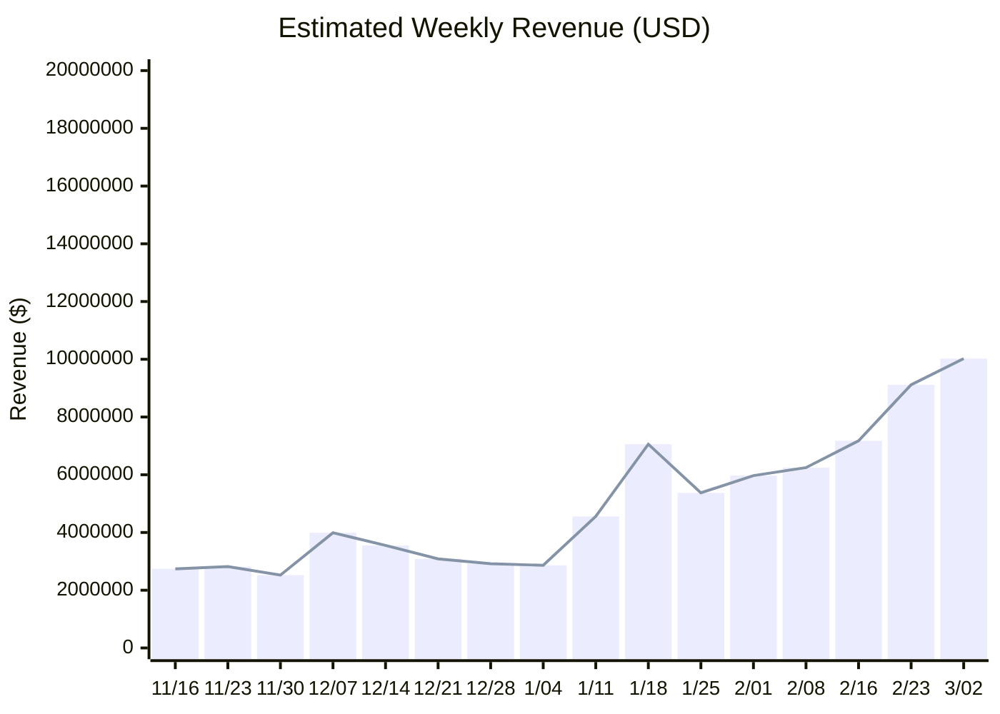
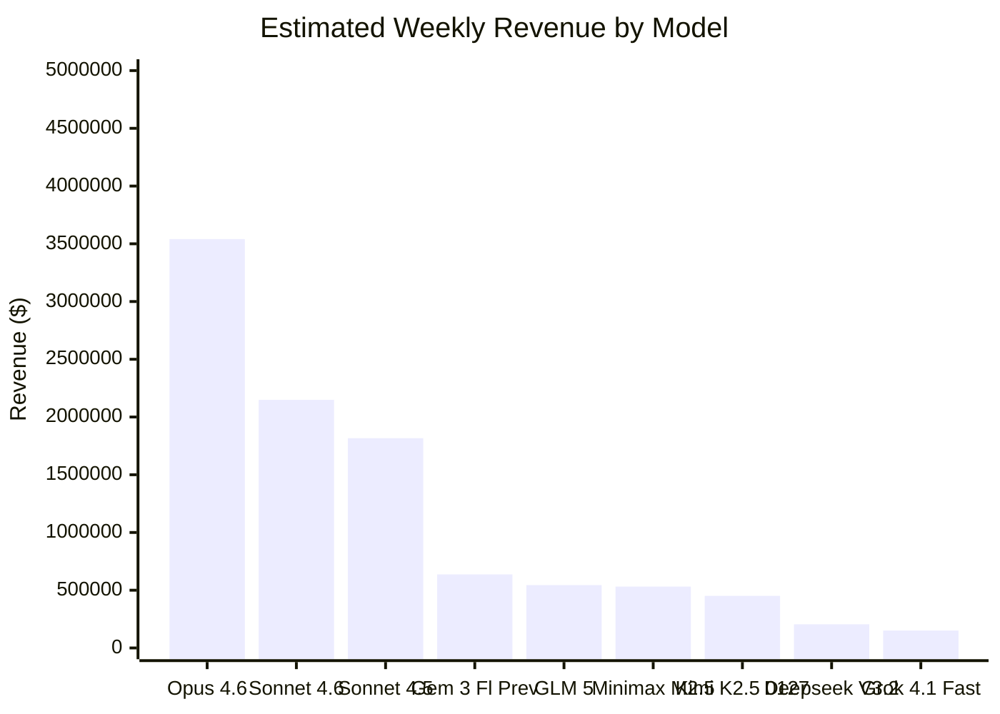
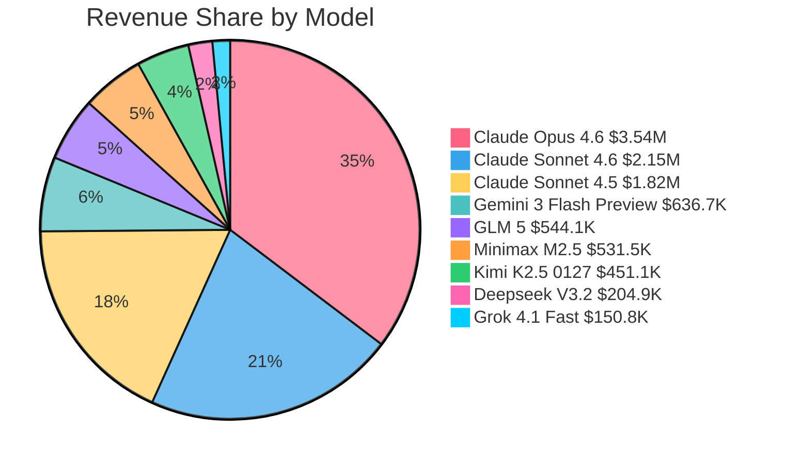
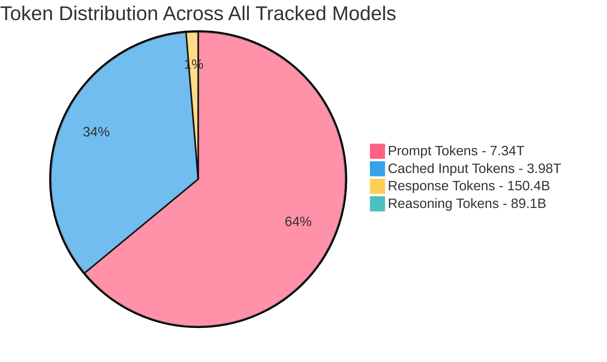

# OpenRouter Inference Revenue Statistics

> Estimated inference revenue across models on [OpenRouter](https://openrouter.ai/rankings), calculated from public usage data and pricing.

**Last updated:** 2026-03-02

## Summary

| Metric | Value |
|--------|-------|
| Estimated Weekly Revenue | **$10.02M** |
| Total Tokens Tracked | **7.58T** |
| Models Tracked | **10** (9 paid, 1 free) |

## Revenue Over Time

```mermaid
xychart-beta
    title "Estimated Weekly Revenue (USD)"
    x-axis ["11/16", "11/23", "11/30", "12/07", "12/14", "12/21", "12/28", "1/04", "1/11", "1/18", "1/25", "2/01", "2/08", "2/16", "2/23", "3/02"]
    y-axis "Revenue ($)" 0 --> 20000000
    bar [2740620.94, 2816925.48, 2523142.13, 3991396.39, 3551394.6, 3084659.53, 2918272.88, 2862056.98, 4558077.75, 7057753.91, 5373700.56, 5970586.37, 6247827.58, 7177565.34, 9116055.43, 10024024.86]
    line [2740620.94, 2816925.48, 2523142.13, 3991396.39, 3551394.6, 3084659.53, 2918272.88, 2862056.98, 4558077.75, 7057753.91, 5373700.56, 5970586.37, 6247827.58, 7177565.34, 9116055.43, 10024024.86]
```

## Revenue by Model (Top 9)

```mermaid
xychart-beta
    title "Estimated Weekly Revenue by Model"
    x-axis ["Opus 4.6", "Sonnet 4.6", "Sonnet 4.5", "Gem 3 Fl Prev", "GLM 5", "Minimax M2.5", "Kimi K2.5 0127", "Deepseek V3.2", "Grok 4.1 Fast"]
    y-axis "Revenue ($)" 0 --> 5000000
    bar [3540510.62, 2148021.8, 1816482.64, 636716.68, 544056.45, 531517.13, 451075.63, 204883.97, 150759.95]
```

## Revenue Share

```mermaid
%%{init: {'theme': 'base', 'themeVariables': {'pie1': '#FF6384', 'pie2': '#36A2EB', 'pie3': '#FFCE56', 'pie4': '#4BC0C0', 'pie5': '#9966FF', 'pie6': '#FF9F40', 'pie7': '#2ECC71', 'pie8': '#FF66B2', 'pie9': '#00CCFF', 'pie10': '#E74C3C', 'pie11': '#F39C12', 'pie12': '#1ABC9C'}}}%%
pie
    title Revenue Share by Model
    "Claude Opus 4.6 $3.54M" : 3540510.62
    "Claude Sonnet 4.6 $2.15M" : 2148021.8
    "Claude Sonnet 4.5 $1.82M" : 1816482.64
    "Gemini 3 Flash Preview $636.7K" : 636716.68
    "GLM 5 $544.1K" : 544056.45
    "Minimax M2.5 $531.5K" : 531517.13
    "Kimi K2.5 0127 $451.1K" : 451075.63
    "Deepseek V3.2 $204.9K" : 204883.97
    "Grok 4.1 Fast $150.8K" : 150759.95
```

## Token Type Distribution

```mermaid
%%{init: {'theme': 'base', 'themeVariables': {'pie1': '#FF6384', 'pie2': '#36A2EB', 'pie3': '#FFCE56', 'pie4': '#4BC0C0', 'pie5': '#9966FF', 'pie6': '#FF9F40', 'pie7': '#2ECC71', 'pie8': '#FF66B2', 'pie9': '#00CCFF', 'pie10': '#E74C3C', 'pie11': '#F39C12', 'pie12': '#1ABC9C'}}}%%
pie
    title Token Distribution Across All Tracked Models
    "Prompt Tokens - 7.34T" : 7341844426070
    "Cached Input Tokens - 3.98T" : 3978998296844
    "Response Tokens - 150.4B" : 150405697478
    "Reasoning Tokens - 89.1B" : 89097186591
```

## Model Breakdown

| Rank | Model | Total Tokens | Cached | Prompt % | Compl. % | Input Price | Output Price | Est. Revenue | WoW |
|------|-------|-------------|--------|----------|----------|-------------|-------------|-------------|-----|
| 6 | [Claude Opus 4.6](https://openrouter.ai/anthropic/claude-4.6-opus-20260205) | 634.0B | 409.4B | 98.7% | 1.3% | $5.00/M | $25.00/M | $3.54M | -1% |
| 5 | [Claude Sonnet 4.6](https://openrouter.ai/anthropic/claude-4.6-sonnet-20260217) | 636.0B | 442.0B | 98.6% | 1.4% | $3.00/M | $15.00/M | $2.15M | +113% |
| 9 | [Claude Sonnet 4.5](https://openrouter.ai/anthropic/claude-4.5-sonnet-20250929) | 529.0B | 361.7B | 98.1% | 1.9% | $3.00/M | $15.00/M | $1.82M | -1% |
| 2 | [Gemini 3 Flash Preview](https://openrouter.ai/google/gemini-3-flash-preview-20251217) | 1.03T | 482.0B | 96.2% | 3.8% | $0.5000/M | $3.00/M | $636.7K | +20% |
| 10 | [GLM 5](https://openrouter.ai/z-ai/glm-5-20260211) | 502.0B | 227.8B | 97.3% | 2.7% | $0.9500/M | $2.55/M | $544.1K | -37% |
| 1 | [Minimax M2.5](https://openrouter.ai/minimax/minimax-m2.5-20260211) | 1.63T | 1.18T | 98.9% | 1.1% | $0.2950/M | $1.20/M | $531.5K | -37% |
| 4 | [Kimi K2.5 0127](https://openrouter.ai/moonshotai/kimi-k2.5-0127) | 692.0B | 485.3B | 97.5% | 2.5% | $0.4500/M | $2.20/M | $451.1K | -33% |
| 3 | [Deepseek V3.2](https://openrouter.ai/deepseek/deepseek-v3.2-20251201) | 800.0B | 238.8B | 96.0% | 4.0% | $0.2500/M | $0.4000/M | $204.9K | +7% |
| 7 | [Grok 4.1 Fast](https://openrouter.ai/x-ai/grok-4.1-fast) | 595.0B | 149.0B | 86.4% | 13.6% | $0.2000/M | $0.5000/M | $150.8K | -11% |
| 8 | [Trinity Large Preview (free)](https://openrouter.ai/arcee-ai/trinity-large-preview:free) | 537.0B | 0 | 97.9% | 2.1% | Free | Free | $0.00 | +20% |

## Methodology

This data is collected automatically from public sources:

1. **Model Pricing**: Fetched from the [OpenRouter API](https://openrouter.ai/api/v1/models) — per-token prices for prompt, completion, reasoning, and cache reads
2. **Usage Rankings**: Scraped from the [OpenRouter Rankings](https://openrouter.ai/rankings) page — top models by weekly token volume
3. **Token Breakdown**: Extracted from each model page's embedded daily analytics data — exact daily counts of prompt, completion, reasoning, and cached input tokens, summed over the most recent 7 full days

**Revenue Calculation**:
- `revenue = prompt_tokens × prompt_price + completion_tokens × output_price + cached_tokens × cache_read_price`
- Completion tokens include reasoning tokens (standard OpenAI convention); reasoning is **not** double-counted
- Cached input tokens are charged at the discounted `input_cache_read` rate

**Caveats**:
- Revenue estimates use list prices; actual revenue may differ due to volume discounts or BYOK usage
- Only the top models from the rankings page are tracked; the long tail of smaller models is not included
- Free models (price = $0) contribute $0 to revenue regardless of usage volume

---

*Data collected by [openrouter-inference-stats](https://github.com/johnbean393/openrouter-inference-stats) and updated weekly via GitHub Actions.*
