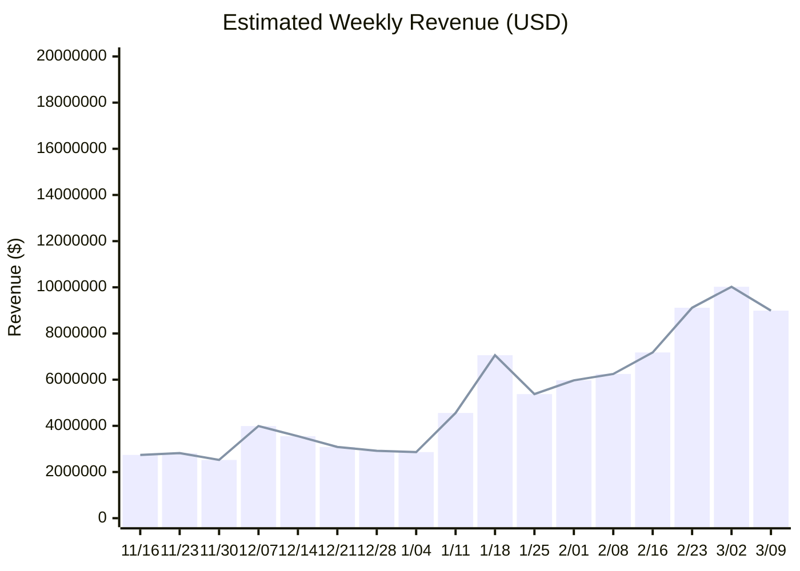
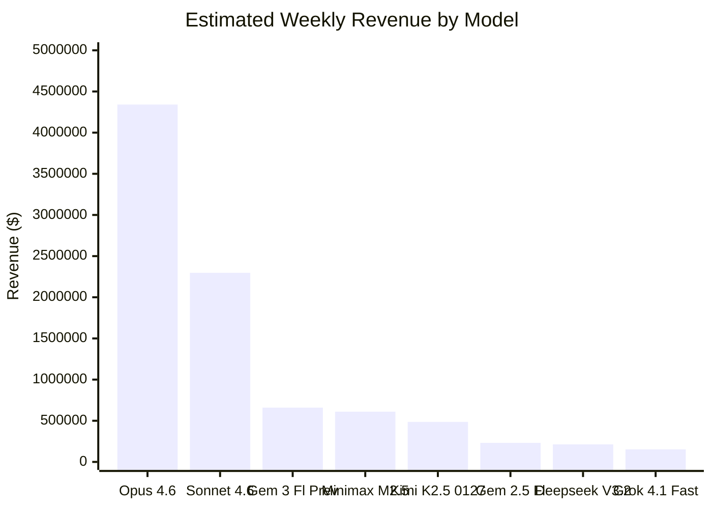
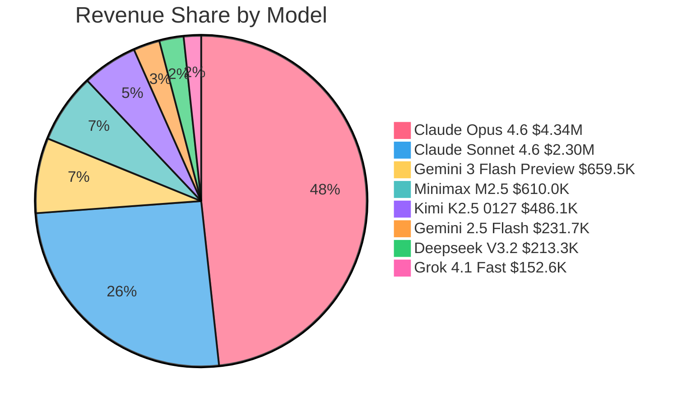
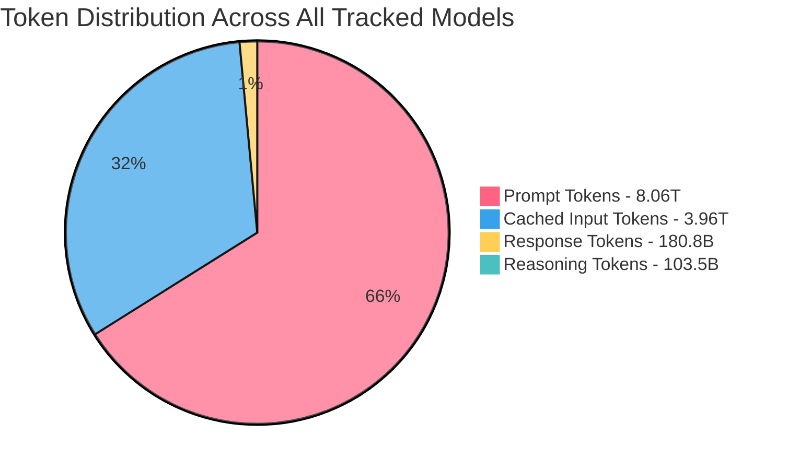

# OpenRouter Inference Revenue Statistics

> Estimated inference revenue across models on [OpenRouter](https://openrouter.ai/rankings), calculated from public usage data and pricing.

**Last updated:** 2026-03-09

## Summary

| Metric | Value |
|--------|-------|
| Estimated Weekly Revenue | **$8.99M** |
| Total Tokens Tracked | **8.35T** |
| Models Tracked | **10** (8 paid, 2 free) |

## Revenue Over Time

```mermaid
xychart-beta
    title "Estimated Weekly Revenue (USD)"
    x-axis ["11/16", "11/23", "11/30", "12/07", "12/14", "12/21", "12/28", "1/04", "1/11", "1/18", "1/25", "2/01", "2/08", "2/16", "2/23", "3/02", "3/09"]
    y-axis "Revenue ($)" 0 --> 20000000
    bar [2740620.94, 2816925.48, 2523142.13, 3991396.39, 3551394.6, 3084659.53, 2918272.88, 2862056.98, 4558077.75, 7057753.91, 5373700.56, 5970586.37, 6247827.58, 7177565.34, 9116055.43, 10024024.86, 8991833.66]
    line [2740620.94, 2816925.48, 2523142.13, 3991396.39, 3551394.6, 3084659.53, 2918272.88, 2862056.98, 4558077.75, 7057753.91, 5373700.56, 5970586.37, 6247827.58, 7177565.34, 9116055.43, 10024024.86, 8991833.66]
```

## Revenue by Model (Top 8)

```mermaid
xychart-beta
    title "Estimated Weekly Revenue by Model"
    x-axis ["Opus 4.6", "Sonnet 4.6", "Gem 3 Fl Prev", "Minimax M2.5", "Kimi K2.5 0127", "Gem 2.5 Fl", "Deepseek V3.2", "Grok 4.1 Fast"]
    y-axis "Revenue ($)" 0 --> 5000000
    bar [4341012.78, 2297626.29, 659465.56, 610024.41, 486119.14, 231688.21, 213338.32, 152558.95]
```

## Revenue Share

```mermaid
%%{init: {'theme': 'base', 'themeVariables': {'pie1': '#FF6384', 'pie2': '#36A2EB', 'pie3': '#FFCE56', 'pie4': '#4BC0C0', 'pie5': '#9966FF', 'pie6': '#FF9F40', 'pie7': '#2ECC71', 'pie8': '#FF66B2', 'pie9': '#00CCFF', 'pie10': '#E74C3C', 'pie11': '#F39C12', 'pie12': '#1ABC9C'}}}%%
pie
    title Revenue Share by Model
    "Claude Opus 4.6 $4.34M" : 4341012.78
    "Claude Sonnet 4.6 $2.30M" : 2297626.29
    "Gemini 3 Flash Preview $659.5K" : 659465.56
    "Minimax M2.5 $610.0K" : 610024.41
    "Kimi K2.5 0127 $486.1K" : 486119.14
    "Gemini 2.5 Flash $231.7K" : 231688.21
    "Deepseek V3.2 $213.3K" : 213338.32
    "Grok 4.1 Fast $152.6K" : 152558.95
```

## Token Type Distribution

```mermaid
%%{init: {'theme': 'base', 'themeVariables': {'pie1': '#FF6384', 'pie2': '#36A2EB', 'pie3': '#FFCE56', 'pie4': '#4BC0C0', 'pie5': '#9966FF', 'pie6': '#FF9F40', 'pie7': '#2ECC71', 'pie8': '#FF66B2', 'pie9': '#00CCFF', 'pie10': '#E74C3C', 'pie11': '#F39C12', 'pie12': '#1ABC9C'}}}%%
pie
    title Token Distribution Across All Tracked Models
    "Prompt Tokens - 8.06T" : 8060813759566
    "Cached Input Tokens - 3.96T" : 3956942264533
    "Response Tokens - 180.8B" : 180751908859
    "Reasoning Tokens - 103.5B" : 103529223423
```

## Model Breakdown

| Rank | Model | Total Tokens | Cached | Prompt % | Compl. % | Input Price | Output Price | Est. Revenue | WoW |
|------|-------|-------------|--------|----------|----------|-------------|-------------|-------------|-----|
| 4 | [Claude Opus 4.6](https://openrouter.ai/anthropic/claude-4.6-opus-20260205) | 771.0B | 532.1B | 98.6% | 1.4% | $5.00/M | $25.00/M | $4.34M | +22% |
| 7 | [Claude Sonnet 4.6](https://openrouter.ai/anthropic/claude-4.6-sonnet-20260217) | 680.0B | 458.8B | 98.5% | 1.5% | $3.00/M | $15.00/M | $2.30M | +7% |
| 2 | [Gemini 3 Flash Preview](https://openrouter.ai/google/gemini-3-flash-preview-20251217) | 1.04T | 477.5B | 95.6% | 4.4% | $0.5000/M | $3.00/M | $659.5K | +2% |
| 1 | [Minimax M2.5](https://openrouter.ai/minimax/minimax-m2.5-20260211) | 1.87T | 1.45T | 99.0% | 1.0% | $0.2950/M | $1.20/M | $610.0K | +15% |
| 6 | [Kimi K2.5 0127](https://openrouter.ai/moonshotai/kimi-k2.5-0127) | 744.0B | 542.5B | 97.8% | 2.2% | $0.4500/M | $2.20/M | $486.1K | +8% |
| 10 | [Gemini 2.5 Flash](https://openrouter.ai/google/gemini-2.5-flash) | 518.0B | 156.7B | 93.7% | 6.3% | $0.3000/M | $2.50/M | $231.7K | +3% |
| 3 | [Deepseek V3.2](https://openrouter.ai/deepseek/deepseek-v3.2-20251201) | 832.0B | 197.8B | 95.8% | 4.2% | $0.2500/M | $0.4000/M | $213.3K | +4% |
| 8 | [Grok 4.1 Fast](https://openrouter.ai/x-ai/grok-4.1-fast) | 615.0B | 140.4B | 87.8% | 12.2% | $0.2000/M | $0.5000/M | $152.6K | +3% |
| 5 | [Step 3.5 Flash (free)](https://openrouter.ai/stepfun/step-3.5-flash:free) | 748.0B | 0 | 96.3% | 3.7% | Free | Free | $0.00 | +69% |
| 9 | [Trinity Large Preview (free)](https://openrouter.ai/arcee-ai/trinity-large-preview:free) | 527.0B | 0 | 97.6% | 2.4% | Free | Free | $0.00 | -2% |

## Methodology

This data is collected automatically from public sources:

1. **Model Pricing**: Fetched from the [OpenRouter API](https://openrouter.ai/api/v1/models) — per-token prices for prompt, completion, reasoning, and cache reads
2. **Usage Rankings**: Scraped from the [OpenRouter Rankings](https://openrouter.ai/rankings) page — top models by weekly token volume
3. **Token Breakdown**: Extracted from each model page's embedded daily analytics data — exact daily counts of prompt, completion, reasoning, and cached input tokens, summed over the most recent 7 full days

**Revenue Calculation**:
- `revenue = prompt_tokens × prompt_price + completion_tokens × output_price + cached_tokens × cache_read_price`
- Completion tokens include reasoning tokens (standard OpenAI convention); reasoning is **not** double-counted
- Cached input tokens are charged at the discounted `input_cache_read` rate

**Caveats**:
- Revenue estimates use list prices; actual revenue may differ due to volume discounts or BYOK usage
- Only the top models from the rankings page are tracked; the long tail of smaller models is not included
- Free models (price = $0) contribute $0 to revenue regardless of usage volume

---

*Data collected by [openrouter-inference-stats](https://github.com/johnbean393/openrouter-inference-stats) and updated weekly via GitHub Actions.*
