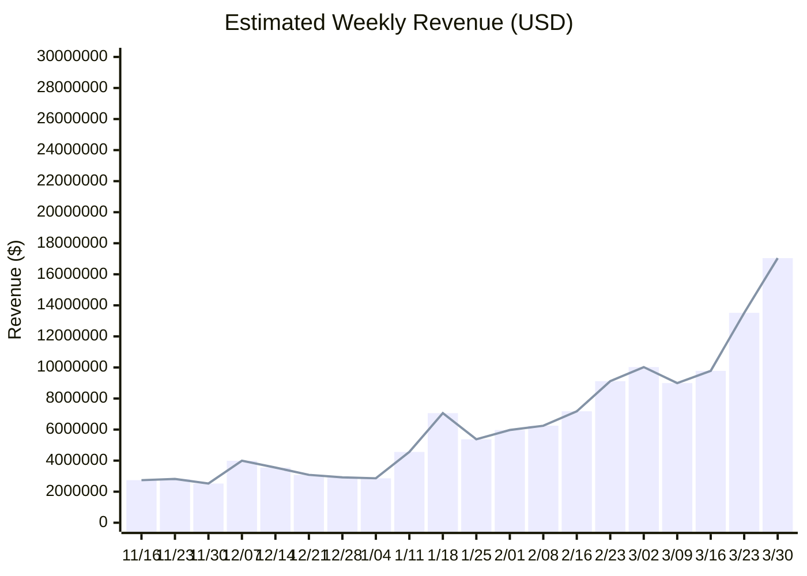
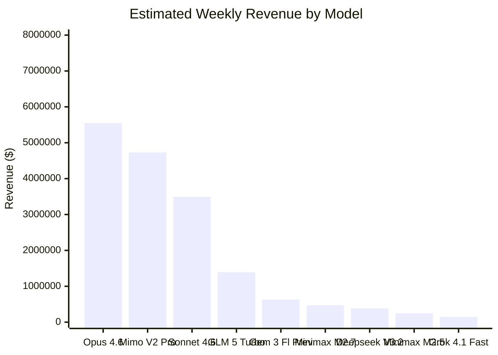
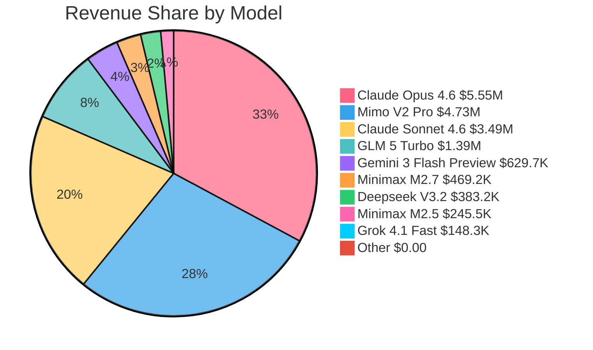
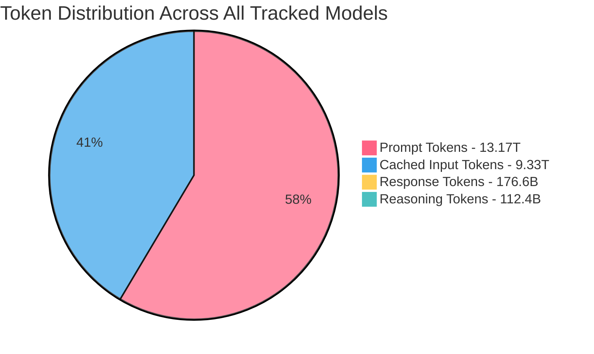

# OpenRouter Inference Revenue Statistics

> Estimated inference revenue across models on [OpenRouter](https://openrouter.ai/rankings), calculated from public usage data and pricing.

**Last updated:** 2026-03-30

## Summary

| Metric | Value |
|--------|-------|
| Estimated Weekly Revenue | **$17.04M** |
| Total Tokens Tracked | **13.46T** |
| Models Tracked | **10** (9 paid, 1 free) |

## Revenue Over Time

```mermaid
xychart-beta
    title "Estimated Weekly Revenue (USD)"
    x-axis ["11/16", "11/23", "11/30", "12/07", "12/14", "12/21", "12/28", "1/04", "1/11", "1/18", "1/25", "2/01", "2/08", "2/16", "2/23", "3/02", "3/09", "3/16", "3/23", "3/30"]
    y-axis "Revenue ($)" 0 --> 30000000
    bar [2740620.94, 2816925.48, 2523142.13, 3991396.39, 3551394.6, 3084659.53, 2918272.88, 2862056.98, 4558077.75, 7057753.91, 5373700.56, 5970586.37, 6247827.58, 7177565.34, 9116055.43, 10024024.86, 8991833.66, 9781034.43, 13516359.09, 17042158.26]
    line [2740620.94, 2816925.48, 2523142.13, 3991396.39, 3551394.6, 3084659.53, 2918272.88, 2862056.98, 4558077.75, 7057753.91, 5373700.56, 5970586.37, 6247827.58, 7177565.34, 9116055.43, 10024024.86, 8991833.66, 9781034.43, 13516359.09, 17042158.26]
```

## Revenue by Model (Top 9)

```mermaid
xychart-beta
    title "Estimated Weekly Revenue by Model"
    x-axis ["Opus 4.6", "Mimo V2 Pro", "Sonnet 4.6", "GLM 5 Turbo", "Gem 3 Fl Prev", "Minimax M2.7", "Deepseek V3.2", "Minimax M2.5", "Grok 4.1 Fast"]
    y-axis "Revenue ($)" 0 --> 8000000
    bar [5550263.78, 4729920.31, 3492401.83, 1393595.08, 629678.63, 469239.53, 383226.6, 245532.66, 148299.84]
```

## Revenue Share

```mermaid
%%{init: {'theme': 'base', 'themeVariables': {'pie1': '#FF6384', 'pie2': '#36A2EB', 'pie3': '#FFCE56', 'pie4': '#4BC0C0', 'pie5': '#9966FF', 'pie6': '#FF9F40', 'pie7': '#2ECC71', 'pie8': '#FF66B2', 'pie9': '#00CCFF', 'pie10': '#E74C3C', 'pie11': '#F39C12', 'pie12': '#1ABC9C'}}}%%
pie
    title Revenue Share by Model
    "Claude Opus 4.6 $5.55M" : 5550263.78
    "Mimo V2 Pro $4.73M" : 4729920.31
    "Claude Sonnet 4.6 $3.49M" : 3492401.83
    "GLM 5 Turbo $1.39M" : 1393595.08
    "Gemini 3 Flash Preview $629.7K" : 629678.63
    "Minimax M2.7 $469.2K" : 469239.53
    "Deepseek V3.2 $383.2K" : 383226.6
    "Minimax M2.5 $245.5K" : 245532.66
    "Grok 4.1 Fast $148.3K" : 148299.84
    "Other $0.00" : 0.0
```

## Token Type Distribution

```mermaid
%%{init: {'theme': 'base', 'themeVariables': {'pie1': '#FF6384', 'pie2': '#36A2EB', 'pie3': '#FFCE56', 'pie4': '#4BC0C0', 'pie5': '#9966FF', 'pie6': '#FF9F40', 'pie7': '#2ECC71', 'pie8': '#FF66B2', 'pie9': '#00CCFF', 'pie10': '#E74C3C', 'pie11': '#F39C12', 'pie12': '#1ABC9C'}}}%%
pie
    title Token Distribution Across All Tracked Models
    "Prompt Tokens - 13.17T" : 13168606626095
    "Cached Input Tokens - 9.33T" : 9331017853462
    "Response Tokens - 176.6B" : 176562173337
    "Reasoning Tokens - 112.4B" : 112389525849
```

## Model Breakdown

| Rank | Model | Total Tokens | Cached | Prompt % | Compl. % | Input Price | Output Price | Est. Revenue | WoW |
|------|-------|-------------|--------|----------|----------|-------------|-------------|-------------|-----|
| 6 | [Claude Opus 4.6](https://openrouter.ai/anthropic/claude-4.6-opus-20260205) | 995.0B | 667.9B | 98.8% | 1.2% | $5.00/M | $25.00/M | $5.55M | +2% |
| 1 | [Mimo V2 Pro](https://openrouter.ai/xiaomi/mimo-v2-pro-20260318) | 3.96T | 3.57T | 99.3% | 0.7% | $1.00/M | $3.00/M | $4.73M | +165% |
| 5 | [Claude Sonnet 4.6](https://openrouter.ai/anthropic/claude-4.6-sonnet-20260217) | 1.04T | 698.4B | 98.6% | 1.4% | $3.00/M | $15.00/M | $3.49M | 0% |
| 8 | [GLM 5 Turbo](https://openrouter.ai/z-ai/glm-5-turbo-20260315) | 968.0B | 917.7B | 99.6% | 0.4% | $1.20/M | $4.00/M | $1.39M | -6% |
| 7 | [Gemini 3 Flash Preview](https://openrouter.ai/google/gemini-3-flash-preview-20251217) | 972.0B | 368.9B | 94.8% | 5.2% | $0.5000/M | $3.00/M | $629.7K | +3% |
| 3 | [Minimax M2.7](https://openrouter.ai/minimax/minimax-m2.7-20260318) | 1.29T | 1.07T | 98.4% | 1.6% | $0.3000/M | $1.20/M | $469.2K | +253% |
| 4 | [Deepseek V3.2](https://openrouter.ai/deepseek/deepseek-v3.2-20251201) | 1.24T | 428.5B | 96.8% | 3.2% | $0.2600/M | $0.3800/M | $383.2K | +9% |
| 9 | [Minimax M2.5](https://openrouter.ai/minimax/minimax-m2.5-20260211) | 909.0B | 671.7B | 99.0% | 1.0% | $0.1900/M | $1.15/M | $245.5K | -30% |
| 10 | [Grok 4.1 Fast](https://openrouter.ai/x-ai/grok-4.1-fast) | 599.0B | 147.9B | 88.3% | 11.7% | $0.2000/M | $0.5000/M | $148.3K | +32% |
| 2 | [Step 3.5 Flash (free)](https://openrouter.ai/stepfun/step-3.5-flash:free) | 1.49T | 786.5B | 97.3% | 2.7% | Free | Free | $0.00 | +1% |

## Methodology

This data is collected automatically from public sources:

1. **Model Pricing**: Fetched from the [OpenRouter API](https://openrouter.ai/api/v1/models) — per-token prices for prompt, completion, reasoning, and cache reads
2. **Usage Rankings**: Scraped from the [OpenRouter Rankings](https://openrouter.ai/rankings) page — top models by weekly token volume
3. **Token Breakdown**: Extracted from each model page's embedded daily analytics data — exact daily counts of prompt, completion, reasoning, and cached input tokens, summed over the most recent 7 full days

**Revenue Calculation**:
- `revenue = prompt_tokens × prompt_price + completion_tokens × output_price + cached_tokens × cache_read_price`
- Completion tokens include reasoning tokens (standard OpenAI convention); reasoning is **not** double-counted
- Cached input tokens are charged at the discounted `input_cache_read` rate

**Caveats**:
- Revenue estimates use list prices; actual revenue may differ due to volume discounts or BYOK usage
- Only the top models from the rankings page are tracked; the long tail of smaller models is not included
- Free models (price = $0) contribute $0 to revenue regardless of usage volume

---

*Data collected by [openrouter-inference-stats](https://github.com/johnbean393/openrouter-inference-stats) and updated weekly via GitHub Actions.*
