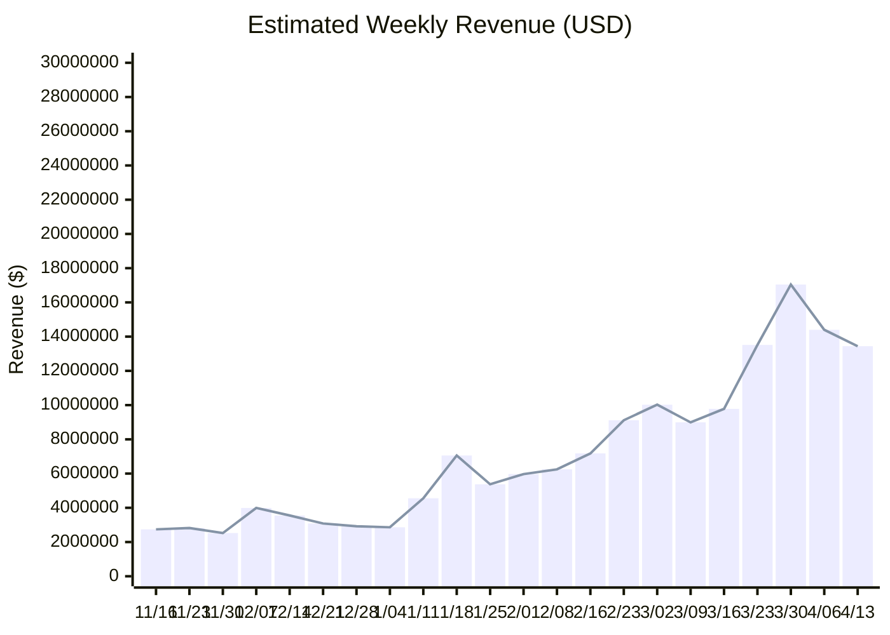
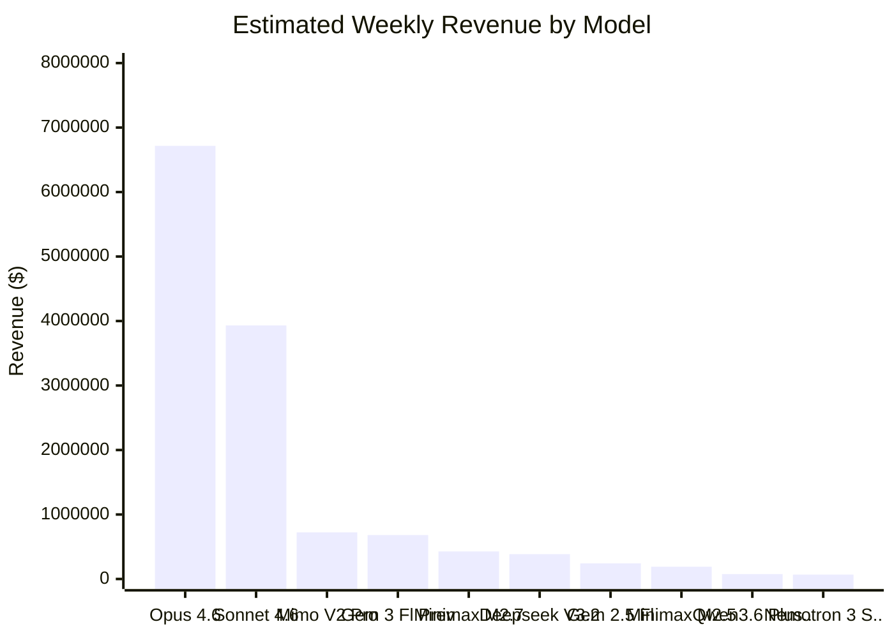
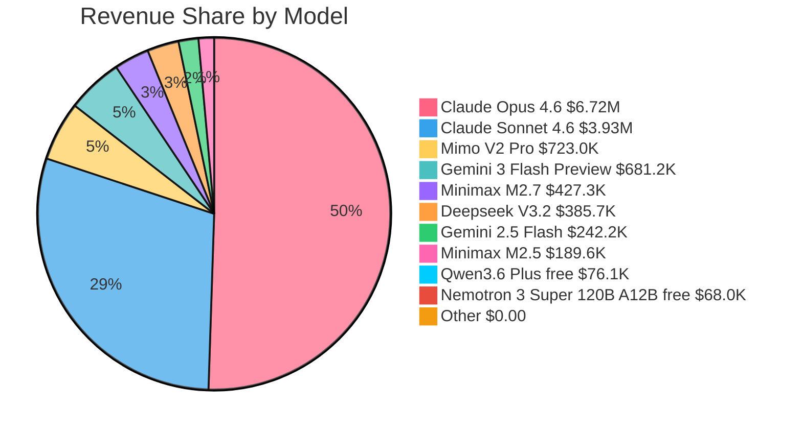
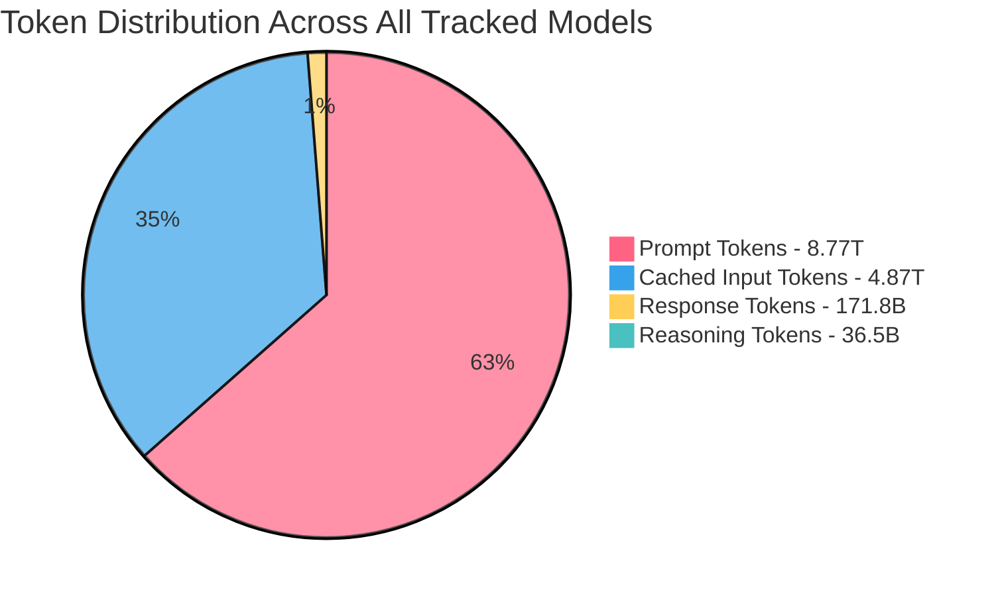

# OpenRouter Inference Revenue Statistics

> Estimated inference revenue across models on [OpenRouter](https://openrouter.ai/rankings), calculated from public usage data and pricing.

**Last updated:** 2026-04-13

## Summary

| Metric | Value |
|--------|-------|
| Estimated Weekly Revenue | **$13.44M** |
| Total Tokens Tracked | **10.44T** |
| Models Tracked | **10** (10 paid, 0 free) |

## Revenue Over Time

```mermaid
xychart-beta
    title "Estimated Weekly Revenue (USD)"
    x-axis ["11/16", "11/23", "11/30", "12/07", "12/14", "12/21", "12/28", "1/04", "1/11", "1/18", "1/25", "2/01", "2/08", "2/16", "2/23", "3/02", "3/09", "3/16", "3/23", "3/30", "4/06", "4/13"]
    y-axis "Revenue ($)" 0 --> 30000000
    bar [2740620.94, 2816925.48, 2523142.13, 3991396.39, 3551394.6, 3084659.53, 2918272.88, 2862056.98, 4558077.75, 7057753.91, 5373700.56, 5970586.37, 6247827.58, 7177565.34, 9116055.43, 10024024.86, 8991833.66, 9781034.43, 13516359.09, 17042158.26, 14398956.04, 13440739.33]
    line [2740620.94, 2816925.48, 2523142.13, 3991396.39, 3551394.6, 3084659.53, 2918272.88, 2862056.98, 4558077.75, 7057753.91, 5373700.56, 5970586.37, 6247827.58, 7177565.34, 9116055.43, 10024024.86, 8991833.66, 9781034.43, 13516359.09, 17042158.26, 14398956.04, 13440739.33]
```

## Revenue by Model (Top 10)

```mermaid
xychart-beta
    title "Estimated Weekly Revenue by Model"
    x-axis ["Opus 4.6", "Sonnet 4.6", "Mimo V2 Pro", "Gem 3 Fl Prev", "Minimax M2.7", "Deepseek V3.2", "Gem 2.5 Fl", "Minimax M2.5", "Qwen3.6 Plus..", "Nemotron 3 S.."]
    y-axis "Revenue ($)" 0 --> 8000000
    bar [6716581.47, 3931094.84, 722970.16, 681230.06, 427313.51, 385698.6, 242179.85, 189580.21, 76138.28, 67952.35]
```

## Revenue Share

```mermaid
%%{init: {'theme': 'base', 'themeVariables': {'pie1': '#FF6384', 'pie2': '#36A2EB', 'pie3': '#FFCE56', 'pie4': '#4BC0C0', 'pie5': '#9966FF', 'pie6': '#FF9F40', 'pie7': '#2ECC71', 'pie8': '#FF66B2', 'pie9': '#00CCFF', 'pie10': '#E74C3C', 'pie11': '#F39C12', 'pie12': '#1ABC9C'}}}%%
pie
    title Revenue Share by Model
    "Claude Opus 4.6 $6.72M" : 6716581.47
    "Claude Sonnet 4.6 $3.93M" : 3931094.84
    "Mimo V2 Pro $723.0K" : 722970.16
    "Gemini 3 Flash Preview $681.2K" : 681230.06
    "Minimax M2.7 $427.3K" : 427313.51
    "Deepseek V3.2 $385.7K" : 385698.6
    "Gemini 2.5 Flash $242.2K" : 242179.85
    "Minimax M2.5 $189.6K" : 189580.21
    "Qwen3.6 Plus free $76.1K" : 76138.28
    "Nemotron 3 Super 120B A12B free $68.0K" : 67952.35
    "Other $0.00" : 0.0
```

## Token Type Distribution

```mermaid
%%{init: {'theme': 'base', 'themeVariables': {'pie1': '#FF6384', 'pie2': '#36A2EB', 'pie3': '#FFCE56', 'pie4': '#4BC0C0', 'pie5': '#9966FF', 'pie6': '#FF9F40', 'pie7': '#2ECC71', 'pie8': '#FF66B2', 'pie9': '#00CCFF', 'pie10': '#E74C3C', 'pie11': '#F39C12', 'pie12': '#1ABC9C'}}}%%
pie
    title Token Distribution Across All Tracked Models
    "Prompt Tokens - 8.77T" : 8766336596972
    "Cached Input Tokens - 4.87T" : 4873405227701
    "Response Tokens - 171.8B" : 171780022501
    "Reasoning Tokens - 36.5B" : 36499837270
```

## Model Breakdown

| Rank | Model | Total Tokens | Cached | Prompt % | Compl. % | Input Price | Output Price | Est. Revenue | WoW |
|------|-------|-------------|--------|----------|----------|-------------|-------------|-------------|-----|
| 3 | [Claude Opus 4.6](https://openrouter.ai/anthropic/claude-4.6-opus-20260205) | 1.19T | 807.9B | 98.6% | 1.4% | $5.00/M | $25.00/M | $6.72M | +17% |
| 5 | [Claude Sonnet 4.6](https://openrouter.ai/anthropic/claude-4.6-sonnet-20260217) | 1.16T | 761.5B | 98.5% | 1.6% | $3.00/M | $15.00/M | $3.93M | +13% |
| 9 | [Mimo V2 Pro](https://openrouter.ai/xiaomi/mimo-v2-pro-20260318) | 606.0B | 545.0B | 99.3% | 0.7% | $1.00/M | $3.00/M | $723.0K | -80% |
| 7 | [Gemini 3 Flash Preview](https://openrouter.ai/google/gemini-3-flash-preview-20251217) | 1.06T | 408.1B | 95.1% | 4.9% | $0.5000/M | $3.00/M | $681.2K | +8% |
| 4 | [Minimax M2.7](https://openrouter.ai/minimax/minimax-m2.7-20260318) | 1.19T | 894.1B | 98.3% | 1.7% | $0.3000/M | $1.20/M | $427.3K | 0% |
| 2 | [Deepseek V3.2](https://openrouter.ai/deepseek/deepseek-v3.2-20251201) | 1.27T | 394.1B | 96.8% | 3.2% | $0.2600/M | $0.3800/M | $385.7K | +7% |
| 10 | [Gemini 2.5 Flash](https://openrouter.ai/google/gemini-2.5-flash) | 543.0B | 186.0B | 93.8% | 6.2% | $0.3000/M | $2.50/M | $242.2K | +14% |
| 6 | [Minimax M2.5](https://openrouter.ai/minimax/minimax-m2.5-20260211) | 1.10T | 876.8B | 99.2% | 0.8% | $0.1180/M | $0.9900/M | $189.6K | +30% |
| 1 | [Qwen3.6 Plus (free)](https://openrouter.ai/qwen/qwen3.6-plus-04-02:free) | 1.66T | 0 | 95.4% | 4.6% | $0.3250/M | $1.95/M | $76.1K | -64% |
| 8 | [Nemotron 3 Super 120B A12B (free)](https://openrouter.ai/nvidia/nemotron-3-super-120b-a12b-20230311:free) | 659.0B | 0 | 99.2% | 0.8% | $0.1000/M | $0.5000/M | $68.0K | +43% |

## Methodology

This data is collected automatically from public sources:

1. **Model Pricing**: Fetched from the [OpenRouter API](https://openrouter.ai/api/v1/models) — per-token prices for prompt, completion, reasoning, and cache reads
2. **Usage Rankings**: Scraped from the [OpenRouter Rankings](https://openrouter.ai/rankings) page — top models by weekly token volume
3. **Token Breakdown**: Extracted from each model page's embedded daily analytics data — exact daily counts of prompt, completion, reasoning, and cached input tokens, summed over the most recent 7 full days

**Revenue Calculation**:
- `revenue = prompt_tokens × prompt_price + completion_tokens × output_price + cached_tokens × cache_read_price`
- Completion tokens include reasoning tokens (standard OpenAI convention); reasoning is **not** double-counted
- Cached input tokens are charged at the discounted `input_cache_read` rate

**Caveats**:
- Revenue estimates use list prices; actual revenue may differ due to volume discounts or BYOK usage
- Only the top models from the rankings page are tracked; the long tail of smaller models is not included
- Free models (price = $0) contribute $0 to revenue regardless of usage volume

---

*Data collected by [openrouter-inference-stats](https://github.com/johnbean393/openrouter-inference-stats) and updated weekly via GitHub Actions.*
