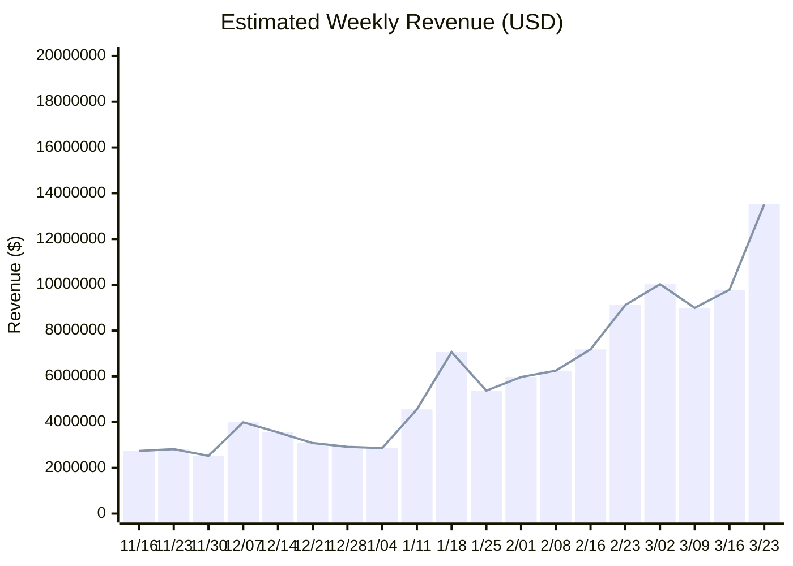
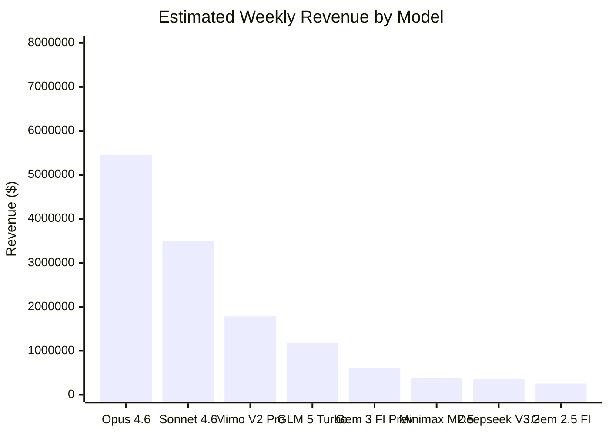
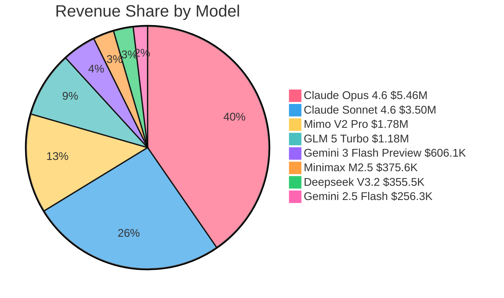

# OpenRouter Inference Revenue Statistics

> Estimated inference revenue across models on [OpenRouter](https://openrouter.ai/rankings), calculated from public usage data and pricing.

**Last updated:** 2026-03-23

## Summary

| Metric | Value |
|--------|-------|
| Estimated Weekly Revenue | **$13.52M** |
| Total Tokens Tracked | **10.89T** |
| Models Tracked | **10** (8 paid, 2 free) |

## Revenue Over Time

```mermaid
xychart-beta
    title "Estimated Weekly Revenue (USD)"
    x-axis ["11/16", "11/23", "11/30", "12/07", "12/14", "12/21", "12/28", "1/04", "1/11", "1/18", "1/25", "2/01", "2/08", "2/16", "2/23", "3/02", "3/09", "3/16", "3/23"]
    y-axis "Revenue ($)" 0 --> 20000000
    bar [2740620.94, 2816925.48, 2523142.13, 3991396.39, 3551394.6, 3084659.53, 2918272.88, 2862056.98, 4558077.75, 7057753.91, 5373700.56, 5970586.37, 6247827.58, 7177565.34, 9116055.43, 10024024.86, 8991833.66, 9781034.43, 13516359.09]
    line [2740620.94, 2816925.48, 2523142.13, 3991396.39, 3551394.6, 3084659.53, 2918272.88, 2862056.98, 4558077.75, 7057753.91, 5373700.56, 5970586.37, 6247827.58, 7177565.34, 9116055.43, 10024024.86, 8991833.66, 9781034.43, 13516359.09]
```

## Revenue by Model (Top 8)

```mermaid
xychart-beta
    title "Estimated Weekly Revenue by Model"
    x-axis ["Opus 4.6", "Sonnet 4.6", "Mimo V2 Pro", "GLM 5 Turbo", "Gem 3 Fl Prev", "Minimax M2.5", "Deepseek V3.2", "Gem 2.5 Fl"]
    y-axis "Revenue ($)" 0 --> 8000000
    bar [5456876.26, 3499240.08, 1783757.05, 1182979.89, 606091.71, 375595.84, 355503.91, 256314.36]
```

## Revenue Share

```mermaid
%%{init: {'theme': 'base', 'themeVariables': {'pie1': '#FF6384', 'pie2': '#36A2EB', 'pie3': '#FFCE56', 'pie4': '#4BC0C0', 'pie5': '#9966FF', 'pie6': '#FF9F40', 'pie7': '#2ECC71', 'pie8': '#FF66B2', 'pie9': '#00CCFF', 'pie10': '#E74C3C', 'pie11': '#F39C12', 'pie12': '#1ABC9C'}}}%%
pie
    title Revenue Share by Model
    "Claude Opus 4.6 $5.46M" : 5456876.26
    "Claude Sonnet 4.6 $3.50M" : 3499240.08
    "Mimo V2 Pro $1.78M" : 1783757.05
    "GLM 5 Turbo $1.18M" : 1182979.89
    "Gemini 3 Flash Preview $606.1K" : 606091.71
    "Minimax M2.5 $375.6K" : 375595.84
    "Deepseek V3.2 $355.5K" : 355503.91
    "Gemini 2.5 Flash $256.3K" : 256314.36
```

## Token Type Distribution

```mermaid
%%{init: {'theme': 'base', 'themeVariables': {'pie1': '#FF6384', 'pie2': '#36A2EB', 'pie3': '#FFCE56', 'pie4': '#4BC0C0', 'pie5': '#9966FF', 'pie6': '#FF9F40', 'pie7': '#2ECC71', 'pie8': '#FF66B2', 'pie9': '#00CCFF', 'pie10': '#E74C3C', 'pie11': '#F39C12', 'pie12': '#1ABC9C'}}}%%
pie
    title Token Distribution Across All Tracked Models
    "Prompt Tokens - 11.21T" : 11207117857261
    "Cached Input Tokens - 6.91T" : 6908036153201
    "Response Tokens - 187.6B" : 187587852607
    "Reasoning Tokens - 95.6B" : 95621076680
```

## Model Breakdown

| Rank | Model | Total Tokens | Cached | Prompt % | Compl. % | Input Price | Output Price | Est. Revenue | WoW |
|------|-------|-------------|--------|----------|----------|-------------|-------------|-------------|-----|
| 7 | [Claude Opus 4.6](https://openrouter.ai/anthropic/claude-4.6-opus-20260205) | 976.0B | 684.6B | 98.8% | 1.2% | $5.00/M | $25.00/M | $5.46M | +19% |
| 5 | [Claude Sonnet 4.6](https://openrouter.ai/anthropic/claude-4.6-sonnet-20260217) | 1.04T | 719.4B | 98.7% | 1.3% | $3.00/M | $15.00/M | $3.50M | +17% |
| 1 | [Mimo V2 Pro](https://openrouter.ai/xiaomi/mimo-v2-pro-20260318) | 1.49T | 1.38T | 99.5% | 0.5% | $1.00/M | $3.00/M | $1.78M | 0% |
| 6 | [GLM 5 Turbo](https://openrouter.ai/z-ai/glm-5-turbo-20260315) | 1.03T | 956.9B | 99.5% | 0.5% | $0.9600/M | $3.20/M | $1.18M | +561% |
| 8 | [Gemini 3 Flash Preview](https://openrouter.ai/google/gemini-3-flash-preview-20251217) | 939.0B | 374.5B | 95.0% | 5.0% | $0.5000/M | $3.00/M | $606.1K | -8% |
| 3 | [Minimax M2.5](https://openrouter.ai/minimax/minimax-m2.5-20260211) | 1.30T | 1.04T | 99.1% | 0.9% | $0.2000/M | $1.17/M | $375.6K | -26% |
| 4 | [Deepseek V3.2](https://openrouter.ai/deepseek/deepseek-v3.2-20251201) | 1.14T | 427.1B | 96.6% | 3.4% | $0.2600/M | $0.3800/M | $355.5K | +10% |
| 10 | [Gemini 2.5 Flash](https://openrouter.ai/google/gemini-2.5-flash) | 581.0B | 214.0B | 94.1% | 5.9% | $0.3000/M | $2.50/M | $256.3K | +3% |
| 2 | [Step 3.5 Flash (free)](https://openrouter.ai/stepfun/step-3.5-flash:free) | 1.48T | 0 | 97.0% | 3.0% | Free | Free | $0.00 | +10% |
| 9 | [Hunter Alpha](https://openrouter.ai/openrouter/hunter-alpha) | 919.0B | 1.11T | 95.4% | 4.6% | Free | Free | $0.00 | +38% |

## Methodology

This data is collected automatically from public sources:

1. **Model Pricing**: Fetched from the [OpenRouter API](https://openrouter.ai/api/v1/models) — per-token prices for prompt, completion, reasoning, and cache reads
2. **Usage Rankings**: Scraped from the [OpenRouter Rankings](https://openrouter.ai/rankings) page — top models by weekly token volume
3. **Token Breakdown**: Extracted from each model page's embedded daily analytics data — exact daily counts of prompt, completion, reasoning, and cached input tokens, summed over the most recent 7 full days

**Revenue Calculation**:
- `revenue = prompt_tokens × prompt_price + completion_tokens × output_price + cached_tokens × cache_read_price`
- Completion tokens include reasoning tokens (standard OpenAI convention); reasoning is **not** double-counted
- Cached input tokens are charged at the discounted `input_cache_read` rate

**Caveats**:
- Revenue estimates use list prices; actual revenue may differ due to volume discounts or BYOK usage
- Only the top models from the rankings page are tracked; the long tail of smaller models is not included
- Free models (price = $0) contribute $0 to revenue regardless of usage volume

---

*Data collected by [openrouter-inference-stats](https://github.com/johnbean393/openrouter-inference-stats) and updated weekly via GitHub Actions.*
