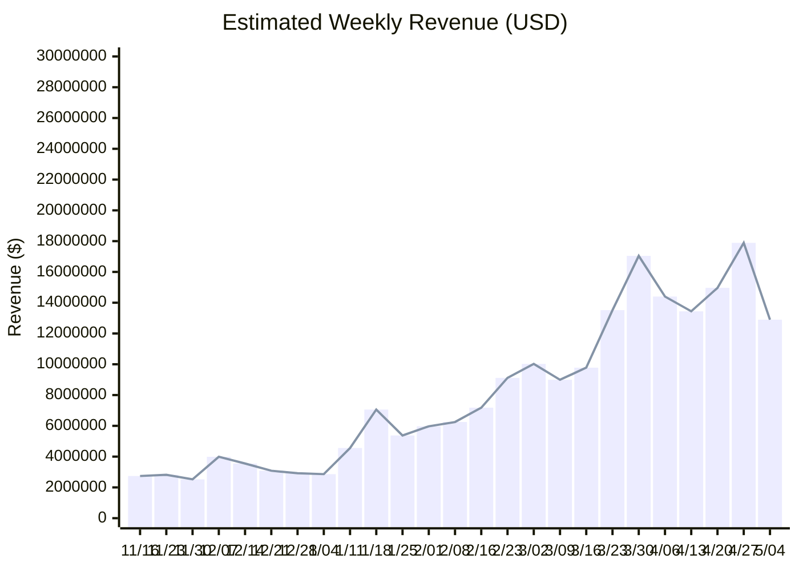
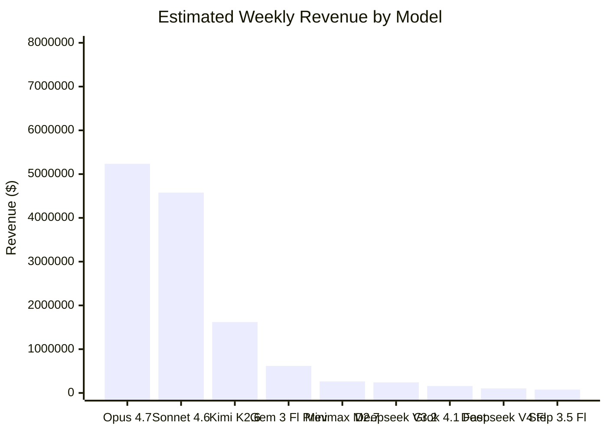
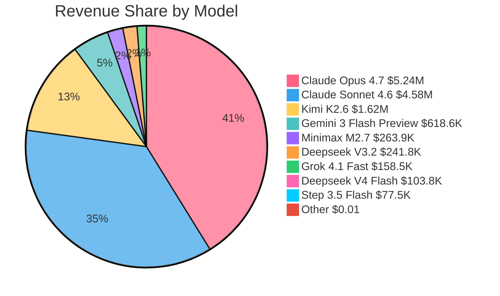

# OpenRouter Inference Revenue Statistics

> Estimated inference revenue across models on [OpenRouter](https://openrouter.ai/rankings), calculated from public usage data and pricing.

**Last updated:** 2026-05-04

## Summary

| Metric | Value |
|--------|-------|
| Estimated Weekly Revenue | **$12.90M** |
| Total Tokens Tracked | **11.85T** |
| Models Tracked | **10** (9 paid, 1 free) |

## Revenue Over Time

```mermaid
xychart-beta
    title "Estimated Weekly Revenue (USD)"
    x-axis ["11/16", "11/23", "11/30", "12/07", "12/14", "12/21", "12/28", "1/04", "1/11", "1/18", "1/25", "2/01", "2/08", "2/16", "2/23", "3/02", "3/09", "3/16", "3/23", "3/30", "4/06", "4/13", "4/20", "4/27", "5/04"]
    y-axis "Revenue ($)" 0 --> 30000000
    bar [2740620.94, 2816925.48, 2523142.13, 3991396.39, 3551394.6, 3084659.53, 2918272.88, 2862056.98, 4558077.75, 7057753.91, 5373700.56, 5970586.37, 6247827.58, 7177565.34, 9116055.43, 10024024.86, 8991833.66, 9781034.43, 13516359.09, 17042158.26, 14398956.04, 13440739.33, 14964047.88, 17890596.37, 12897765.5]
    line [2740620.94, 2816925.48, 2523142.13, 3991396.39, 3551394.6, 3084659.53, 2918272.88, 2862056.98, 4558077.75, 7057753.91, 5373700.56, 5970586.37, 6247827.58, 7177565.34, 9116055.43, 10024024.86, 8991833.66, 9781034.43, 13516359.09, 17042158.26, 14398956.04, 13440739.33, 14964047.88, 17890596.37, 12897765.5]
```

## Revenue by Model (Top 9)

```mermaid
xychart-beta
    title "Estimated Weekly Revenue by Model"
    x-axis ["Opus 4.7", "Sonnet 4.6", "Kimi K2.6", "Gem 3 Fl Prev", "Minimax M2.7", "Deepseek V3.2", "Grok 4.1 Fast", "Deepseek V4 Fl", "Step 3.5 Fl"]
    y-axis "Revenue ($)" 0 --> 8000000
    bar [5235697.65, 4577149.21, 1620801.14, 618629.37, 263883.86, 241813.02, 158517.65, 103773.97, 77499.62]
```

## Revenue Share

```mermaid
%%{init: {'theme': 'base', 'themeVariables': {'pie1': '#FF6384', 'pie2': '#36A2EB', 'pie3': '#FFCE56', 'pie4': '#4BC0C0', 'pie5': '#9966FF', 'pie6': '#FF9F40', 'pie7': '#2ECC71', 'pie8': '#FF66B2', 'pie9': '#00CCFF', 'pie10': '#E74C3C', 'pie11': '#F39C12', 'pie12': '#1ABC9C'}}}%%
pie
    title Revenue Share by Model
    "Claude Opus 4.7 $5.24M" : 5235697.65
    "Claude Sonnet 4.6 $4.58M" : 4577149.21
    "Kimi K2.6 $1.62M" : 1620801.14
    "Gemini 3 Flash Preview $618.6K" : 618629.37
    "Minimax M2.7 $263.9K" : 263883.86
    "Deepseek V3.2 $241.8K" : 241813.02
    "Grok 4.1 Fast $158.5K" : 158517.65
    "Deepseek V4 Flash $103.8K" : 103773.97
    "Step 3.5 Flash $77.5K" : 77499.62
    "Other $0.01" : 0.01
```

## Token Type Distribution

```mermaid
%%{init: {'theme': 'base', 'themeVariables': {'pie1': '#FF6384', 'pie2': '#36A2EB', 'pie3': '#FFCE56', 'pie4': '#4BC0C0', 'pie5': '#9966FF', 'pie6': '#FF9F40', 'pie7': '#2ECC71', 'pie8': '#FF66B2', 'pie9': '#00CCFF', 'pie10': '#E74C3C', 'pie11': '#F39C12', 'pie12': '#1ABC9C'}}}%%
pie
    title Token Distribution Across All Tracked Models
    "Prompt Tokens - 11.50T" : 11504848394148
    "Cached Input Tokens - 7.83T" : 7833821907704
    "Response Tokens - 238.5B" : 238494940975
    "Reasoning Tokens - 99.7B" : 99676224653
```

## Model Breakdown

| Rank | Model | Total Tokens | Cached | Prompt % | Compl. % | Input Price | Output Price | Est. Revenue | WoW |
|------|-------|-------------|--------|----------|----------|-------------|-------------|-------------|-----|
| 5 | [Claude Opus 4.7](https://openrouter.ai/anthropic/claude-4.7-opus-20260416) | 935.0B | 690.8B | 98.9% | 1.1% | $5.00/M | $25.00/M | $5.24M | -19% |
| 3 | [Claude Sonnet 4.6](https://openrouter.ai/anthropic/claude-4.6-sonnet-20260217) | 1.35T | 924.2B | 98.4% | 1.6% | $3.00/M | $15.00/M | $4.58M | -1% |
| 2 | [Kimi K2.6](https://openrouter.ai/moonshotai/kimi-k2.6-20260420) | 1.82T | 1.55T | 98.8% | 1.2% | $0.7400/M | $3.49/M | $1.62M | +15% |
| 4 | [Gemini 3 Flash Preview](https://openrouter.ai/google/gemini-3-flash-preview-20251217) | 973.0B | 295.9B | 95.2% | 4.8% | $0.5000/M | $3.00/M | $618.6K | -6% |
| 8 | [Minimax M2.7](https://openrouter.ai/minimax/minimax-m2.7-20260318) | 729.0B | 498.7B | 97.6% | 2.4% | $0.3000/M | $1.20/M | $263.9K | -8% |
| 6 | [Deepseek V3.2](https://openrouter.ai/deepseek/deepseek-v3.2-20251201) | 907.0B | 316.5B | 95.5% | 4.5% | $0.2520/M | $0.3780/M | $241.8K | -29% |
| 10 | [Grok 4.1 Fast](https://openrouter.ai/x-ai/grok-4.1-fast) | 646.0B | 191.1B | 89.8% | 10.2% | $0.2000/M | $0.5000/M | $158.5K | -13% |
| 9 | [Deepseek V4 Flash](https://openrouter.ai/deepseek/deepseek-v4-flash-20260423) | 704.0B | 456.0B | 96.0% | 4.0% | $0.1400/M | $0.2800/M | $103.8K | +344% |
| 7 | [Step 3.5 Flash](https://openrouter.ai/stepfun/step-3.5-flash) | 752.0B | 613.6B | 98.5% | 1.5% | $0.1000/M | $0.3000/M | $77.5K | +4% |
| 1 | [Hy3 Preview (free)](https://openrouter.ai/tencent/hy3-preview-20260421:free) | 3.03T | 2.30T | 97.6% | 2.4% | Free | Free | $0.00 | +799% |

## Methodology

This data is collected automatically from public sources:

1. **Model Pricing**: Fetched from the [OpenRouter API](https://openrouter.ai/api/v1/models) — per-token prices for prompt, completion, reasoning, and cache reads
2. **Usage Rankings**: Scraped from the [OpenRouter Rankings](https://openrouter.ai/rankings) page — top models by weekly token volume
3. **Token Breakdown**: Extracted from each model page's embedded daily analytics data — exact daily counts of prompt, completion, reasoning, and cached input tokens, summed over the most recent 7 full days

**Revenue Calculation**:
- `revenue = prompt_tokens × prompt_price + completion_tokens × output_price + cached_tokens × cache_read_price`
- Completion tokens include reasoning tokens (standard OpenAI convention); reasoning is **not** double-counted
- Cached input tokens are charged at the discounted `input_cache_read` rate

**Caveats**:
- Revenue estimates use list prices; actual revenue may differ due to volume discounts or BYOK usage
- Only the top models from the rankings page are tracked; the long tail of smaller models is not included
- Free models (price = $0) contribute $0 to revenue regardless of usage volume

---

*Data collected by [openrouter-inference-stats](https://github.com/johnbean393/openrouter-inference-stats) and updated weekly via GitHub Actions.*
