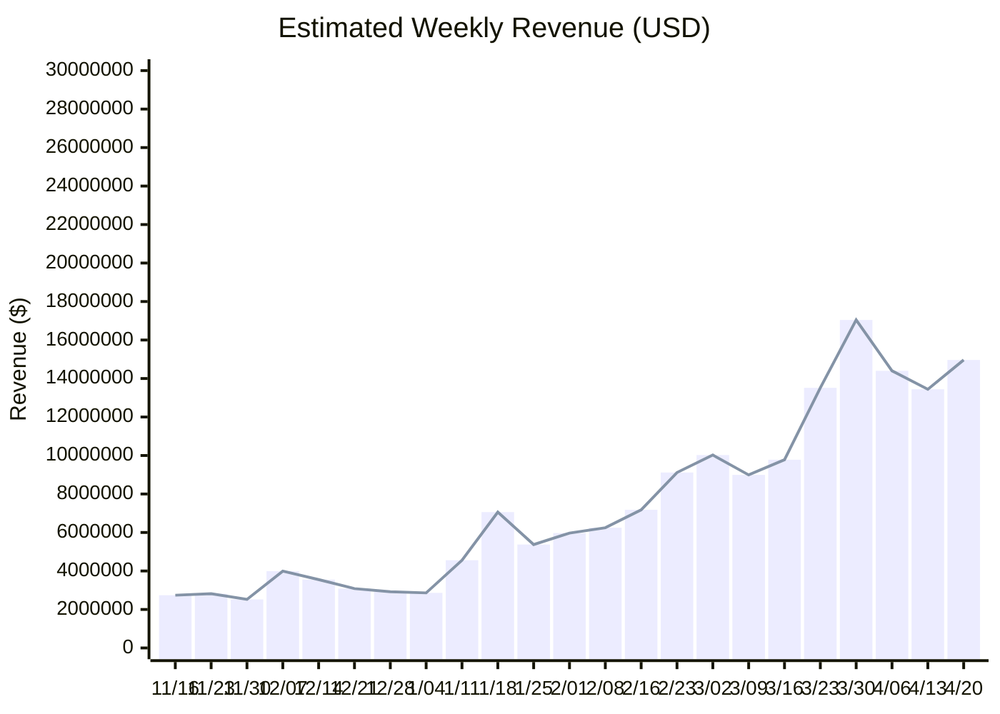
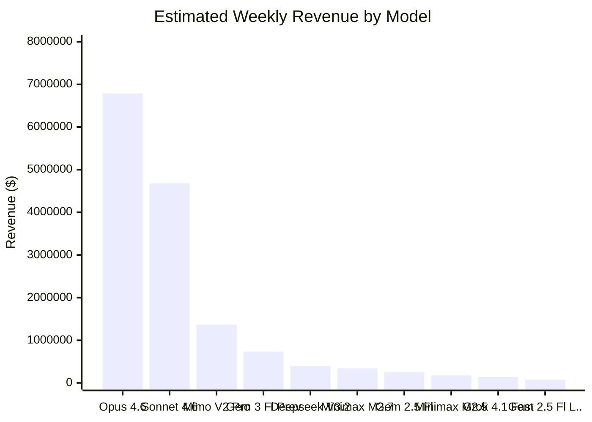
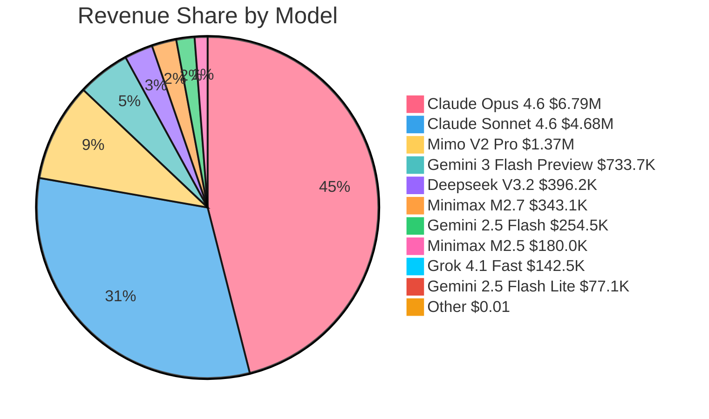
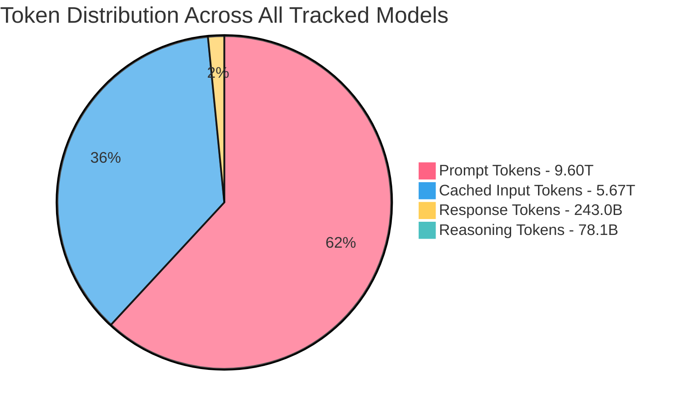

# OpenRouter Inference Revenue Statistics

> Estimated inference revenue across models on [OpenRouter](https://openrouter.ai/rankings), calculated from public usage data and pricing.

**Last updated:** 2026-04-20

## Summary

| Metric | Value |
|--------|-------|
| Estimated Weekly Revenue | **$14.96M** |
| Total Tokens Tracked | **9.92T** |
| Models Tracked | **10** (10 paid, 0 free) |

## Revenue Over Time

```mermaid
xychart-beta
    title "Estimated Weekly Revenue (USD)"
    x-axis ["11/16", "11/23", "11/30", "12/07", "12/14", "12/21", "12/28", "1/04", "1/11", "1/18", "1/25", "2/01", "2/08", "2/16", "2/23", "3/02", "3/09", "3/16", "3/23", "3/30", "4/06", "4/13", "4/20"]
    y-axis "Revenue ($)" 0 --> 30000000
    bar [2740620.94, 2816925.48, 2523142.13, 3991396.39, 3551394.6, 3084659.53, 2918272.88, 2862056.98, 4558077.75, 7057753.91, 5373700.56, 5970586.37, 6247827.58, 7177565.34, 9116055.43, 10024024.86, 8991833.66, 9781034.43, 13516359.09, 17042158.26, 14398956.04, 13440739.33, 14964047.88]
    line [2740620.94, 2816925.48, 2523142.13, 3991396.39, 3551394.6, 3084659.53, 2918272.88, 2862056.98, 4558077.75, 7057753.91, 5373700.56, 5970586.37, 6247827.58, 7177565.34, 9116055.43, 10024024.86, 8991833.66, 9781034.43, 13516359.09, 17042158.26, 14398956.04, 13440739.33, 14964047.88]
```

## Revenue by Model (Top 10)

```mermaid
xychart-beta
    title "Estimated Weekly Revenue by Model"
    x-axis ["Opus 4.6", "Sonnet 4.6", "Mimo V2 Pro", "Gem 3 Fl Prev", "Deepseek V3.2", "Minimax M2.7", "Gem 2.5 Fl", "Minimax M2.5", "Grok 4.1 Fast", "Gem 2.5 Fl L.."]
    y-axis "Revenue ($)" 0 --> 8000000
    bar [6787069.05, 4679561.74, 1370364.54, 733747.55, 396209.61, 343081.33, 254483.24, 179961.03, 142470.8, 77098.98]
```

## Revenue Share

```mermaid
%%{init: {'theme': 'base', 'themeVariables': {'pie1': '#FF6384', 'pie2': '#36A2EB', 'pie3': '#FFCE56', 'pie4': '#4BC0C0', 'pie5': '#9966FF', 'pie6': '#FF9F40', 'pie7': '#2ECC71', 'pie8': '#FF66B2', 'pie9': '#00CCFF', 'pie10': '#E74C3C', 'pie11': '#F39C12', 'pie12': '#1ABC9C'}}}%%
pie
    title Revenue Share by Model
    "Claude Opus 4.6 $6.79M" : 6787069.05
    "Claude Sonnet 4.6 $4.68M" : 4679561.74
    "Mimo V2 Pro $1.37M" : 1370364.54
    "Gemini 3 Flash Preview $733.7K" : 733747.55
    "Deepseek V3.2 $396.2K" : 396209.61
    "Minimax M2.7 $343.1K" : 343081.33
    "Gemini 2.5 Flash $254.5K" : 254483.24
    "Minimax M2.5 $180.0K" : 179961.03
    "Grok 4.1 Fast $142.5K" : 142470.8
    "Gemini 2.5 Flash Lite $77.1K" : 77098.98
    "Other $0.01" : 0.01
```

## Token Type Distribution

```mermaid
%%{init: {'theme': 'base', 'themeVariables': {'pie1': '#FF6384', 'pie2': '#36A2EB', 'pie3': '#FFCE56', 'pie4': '#4BC0C0', 'pie5': '#9966FF', 'pie6': '#FF9F40', 'pie7': '#2ECC71', 'pie8': '#FF66B2', 'pie9': '#00CCFF', 'pie10': '#E74C3C', 'pie11': '#F39C12', 'pie12': '#1ABC9C'}}}%%
pie
    title Token Distribution Across All Tracked Models
    "Prompt Tokens - 9.60T" : 9601291412858
    "Cached Input Tokens - 5.67T" : 5673896331680
    "Response Tokens - 243.0B" : 243003865714
    "Reasoning Tokens - 78.1B" : 78127078242
```

## Model Breakdown

| Rank | Model | Total Tokens | Cached | Prompt % | Compl. % | Input Price | Output Price | Est. Revenue | WoW |
|------|-------|-------------|--------|----------|----------|-------------|-------------|-------------|-----|
| 3 | [Claude Opus 4.6](https://openrouter.ai/anthropic/claude-4.6-opus-20260205) | 1.22T | 830.7B | 98.9% | 1.1% | $5.00/M | $25.00/M | $6.79M | +2% |
| 1 | [Claude Sonnet 4.6](https://openrouter.ai/anthropic/claude-4.6-sonnet-20260217) | 1.38T | 970.1B | 98.6% | 1.5% | $3.00/M | $15.00/M | $4.68M | +19% |
| 4 | [Mimo V2 Pro](https://openrouter.ai/xiaomi/mimo-v2-pro-20260318) | 1.15T | 1.04T | 99.4% | 0.6% | $1.00/M | $3.00/M | $1.37M | +90% |
| 5 | [Gemini 3 Flash Preview](https://openrouter.ai/google/gemini-3-flash-preview-20251217) | 1.14T | 416.9B | 95.1% | 4.9% | $0.5000/M | $3.00/M | $733.7K | +8% |
| 2 | [Deepseek V3.2](https://openrouter.ai/deepseek/deepseek-v3.2-20251201) | 1.28T | 423.4B | 96.5% | 3.5% | $0.2590/M | $0.4200/M | $396.2K | +1% |
| 7 | [Minimax M2.7](https://openrouter.ai/minimax/minimax-m2.7-20260318) | 961.0B | 686.6B | 98.3% | 1.7% | $0.3000/M | $1.20/M | $343.1K | -19% |
| 10 | [Gemini 2.5 Flash](https://openrouter.ai/google/gemini-2.5-flash) | 567.0B | 189.4B | 93.7% | 6.3% | $0.3000/M | $2.50/M | $254.5K | +4% |
| 6 | [Minimax M2.5](https://openrouter.ai/minimax/minimax-m2.5-20260211) | 1.05T | 831.7B | 99.2% | 0.8% | $0.1180/M | $0.9900/M | $180.0K | -5% |
| 9 | [Grok 4.1 Fast](https://openrouter.ai/x-ai/grok-4.1-fast) | 573.0B | 170.3B | 88.7% | 11.3% | $0.2000/M | $0.5000/M | $142.5K | +15% |
| 8 | [Gemini 2.5 Flash Lite](https://openrouter.ai/google/gemini-2.5-flash-lite) | 595.0B | 119.7B | 90.8% | 9.2% | $0.1000/M | $0.4000/M | $77.1K | +10% |

## Methodology

This data is collected automatically from public sources:

1. **Model Pricing**: Fetched from the [OpenRouter API](https://openrouter.ai/api/v1/models) — per-token prices for prompt, completion, reasoning, and cache reads
2. **Usage Rankings**: Scraped from the [OpenRouter Rankings](https://openrouter.ai/rankings) page — top models by weekly token volume
3. **Token Breakdown**: Extracted from each model page's embedded daily analytics data — exact daily counts of prompt, completion, reasoning, and cached input tokens, summed over the most recent 7 full days

**Revenue Calculation**:
- `revenue = prompt_tokens × prompt_price + completion_tokens × output_price + cached_tokens × cache_read_price`
- Completion tokens include reasoning tokens (standard OpenAI convention); reasoning is **not** double-counted
- Cached input tokens are charged at the discounted `input_cache_read` rate

**Caveats**:
- Revenue estimates use list prices; actual revenue may differ due to volume discounts or BYOK usage
- Only the top models from the rankings page are tracked; the long tail of smaller models is not included
- Free models (price = $0) contribute $0 to revenue regardless of usage volume

---

*Data collected by [openrouter-inference-stats](https://github.com/johnbean393/openrouter-inference-stats) and updated weekly via GitHub Actions.*
